# Aurora Downloader

[](https://github.com/52191314/Aurora-Downloader/actions/workflows/ci.yml)
[](LICENSE)
[](https://developer.android.com)
[](https://flutter.dev)

**Aurora Downloader solves the friction of capturing and downloading media on Android.** It seamlessly transforms web browsing into background media capture with an integrated network sniffer, multi-threaded segmented HTTP engine, native HLS/DASH remuxing, and BitTorrent support — all wrapped in a sleek Nordic Glass UI.

---

## ⚡ Quick Start (One Command)

Test, analyze, and spin up Aurora Downloader on your Android device or emulator with a single command:

```bash
git clone https://github.com/52191314/Aurora-Downloader.git && cd Aurora-Downloader && flutter pub get && flutter test && flutter run
```

---

## 🏗️ Architecture Overview

Aurora Downloader decouples media detection from downloading, running background isolation workers to prevent UI main-thread jank.

```mermaid
flowchart TD
    subgraph Browser ["In-App Browser & Sniffer"]
        A[WebView & JS Guard] -->|Intercept Fetch/XHR/DOM| B[Capture Tray & Media Cache]
        B -->|Extract Headers/Cookies| C[Worker Isolate Prober]
    end
    
    subgraph Engine ["Download Engine & Processing"]
        C --> D{Protocol Type}
        D -->|Segmented HTTP| E[Multi-Thread HTTP Chunk Downloader]
        D -->|HLS / DASH| F[AES-128 Decrypt & Segment Fetcher]
        D -->|Magnet / Torrent| G[Native BitTorrent Engine]
    end
    
    subgraph Output ["Storage & Playback"]
        E --> H[Collision-Safe Storage Manager]
        F --> I[Android MediaMuxer TS->MP4 Remux]
        G --> H
        I --> H
        H --> J[Aurora In-App Video Player / Queue]
    end
```



---

## ✨ Why Aurora?

- **Catch Media While Browsing** — Automatically hook DOM, `fetch`/`XHR`, media elements, and resource streams without manual copy-pasting.
- **Survive Real-World CDNs** — Retains session cookies, Referer, custom User-Agents, and WebView-bound fetch routines for WAF/Cloudflare-protected hosts.
- **Finish the Job Reliably** — Pause/resume, multi-chunk HTTP, HLS segment fetching + AES-128 decryption, TS→MP4 remuxing, foreground service protection, and auto-categorization.
- **Modern Nordic UI** — Samsung-style browser chrome, tab groups, customizable capture tray, and dark/light Nordic Glass themes.

---

## 🚀 Key Features

| Feature | Description |
|---------|-------------|
| 📥 **Segmented HTTP Downloads** | Multi-threaded range requests, speed limiter, auto-retry, stall detection, auto-classification, and SHA-256 verification. |
| 🎬 **HLS & DASH Streaming** | Master/media playlist parsing, representation extraction, AES-128 decryption, fMP4/TS segment validation, and native `MediaMuxer` TS→MP4 remuxing. |
| 🧲 **Native BitTorrent** | BitTorrent and magnet link intake powered by high-performance native `libtorrent` bindings. |
| 🌐 **In-App Browser & Sniffer** | Multi-tab support, Samsung-style tab groups, User-Agent switcher, element picker adblock rules, cosmetic block engine, and capture tray. |
| 🛡️ **Hybrid Adblock** | Native C++ adblock engine (`libaurora_adblock.so`: domain trie + Aho-Corasick) with Dart fallback. |
| 🎥 **In-App Player** | Custom video player with full-screen controls, aspect-ratio toggles, speed controls, and automatic header/cookie passthrough. |

---

## 📦 Build Channels & Distribution

Aurora Downloader supports two distinct build configurations controlled by `--dart-define=AURORA_BUILD_CHANNEL`:

| Channel | `--dart-define` | Use Case & Capabilities |
|---------|-----------------|-------------------------|
| **GitHub / Open Source** (Default) | `AURORA_BUILD_CHANNEL=github` | GitHub releases / F-Droid / Sideload builds. No billing client, fat APK with native engines included, full sniffer enabled. |
| **Play Store** | `AURORA_BUILD_CHANNEL=play` | Google Play Store release with Play Billing one-time unlock and on-demand Play Feature Modules. |

### Build Commands

```bash
# Debug build (fat APK, default GitHub channel)
flutter build apk --debug --target-platform android-arm64

# Release build for Play Store (AAB)
flutter build appbundle --release --dart-define=AURORA_BUILD_CHANNEL=play
```

---

## 🌟 Awesome Ecosystem & Community

Aurora Downloader is designed for developers and open-source enthusiasts. It fits into curated developer indices:

- 💙 **[Awesome Flutter](https://github.com/Solido/awesome-flutter)** — Open-source production Flutter applications.
- 🤖 **[Awesome Android](https://github.com/JStumpp/awesome-android)** — Top open-source Android utilities and download managers.
- 🔓 **[Awesome Open Source Apps](https://github.com/serhii-londar/open-source-mac-os-apps)** — Privacy-respecting mobile tools.

Have a feedback idea or feature request? Join our community discussions on [GitHub Discussions](https://github.com/52191314/Aurora-Downloader/discussions) or submit issues via the [Issue Tracker](https://github.com/52191314/Aurora-Downloader/issues).

---

## 🤝 Open for Contributions

We love contributions! Check out our detailed **[CONTRIBUTING.md](CONTRIBUTING.md)** guide to get started.

- 🐛 **[Good First Issues](https://github.com/52191314/Aurora-Downloader/issues?q=is%3Aissue+is%3Aopen+label%3A%22good+first+issue%22)** — Perfect for newcomers looking for quick, high-impact fixes.
- 💡 **[Help Wanted](https://github.com/52191314/Aurora-Downloader/issues?q=is%3Aissue+is%3Aopen+label%3A%22help+wanted%22)** — Feature requests and sniffer enhancements seeking community pull requests.

---

## 📜 Requirements & License

- **Flutter SDK**: Dart `^3.8.1`
- **Android SDK**: Min API **24**, Compile API **36**, NDK **27.0.12077973**
- **License**: [GNU General Public License v3.0](LICENSE)

*Disclaimer: Aurora Downloader is a general-purpose download and browsing tool. Users are responsible for complying with applicable laws and site terms of service.*
