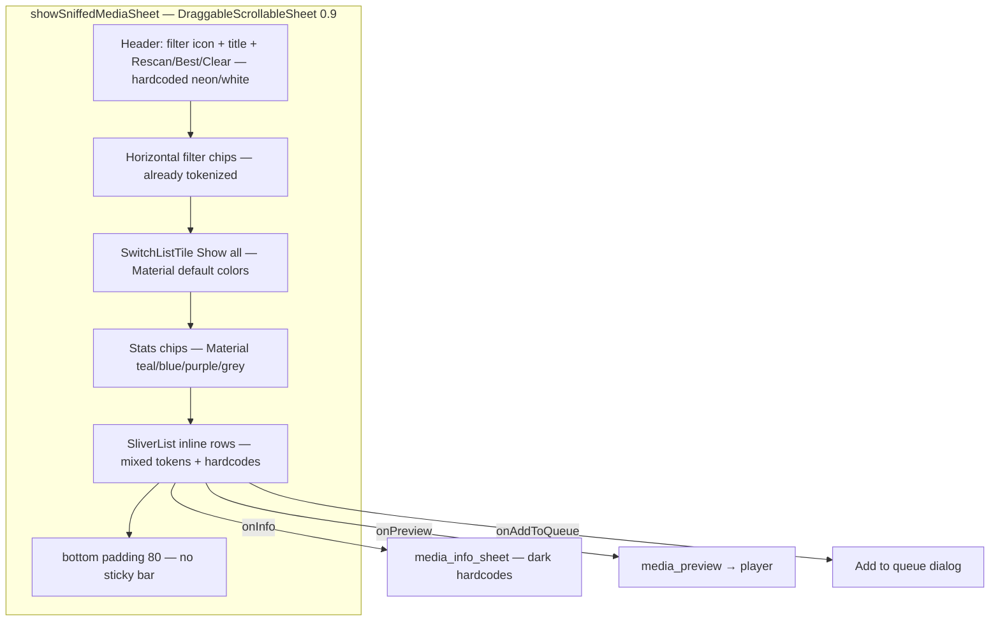
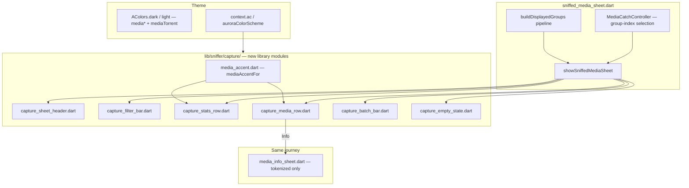
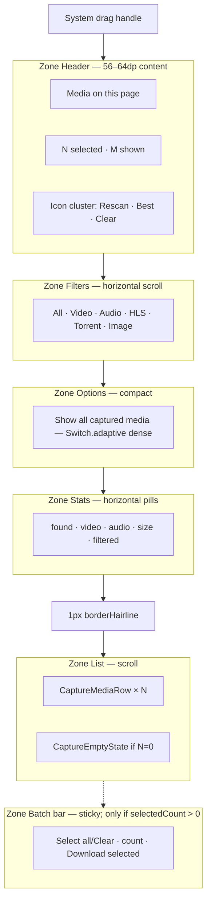
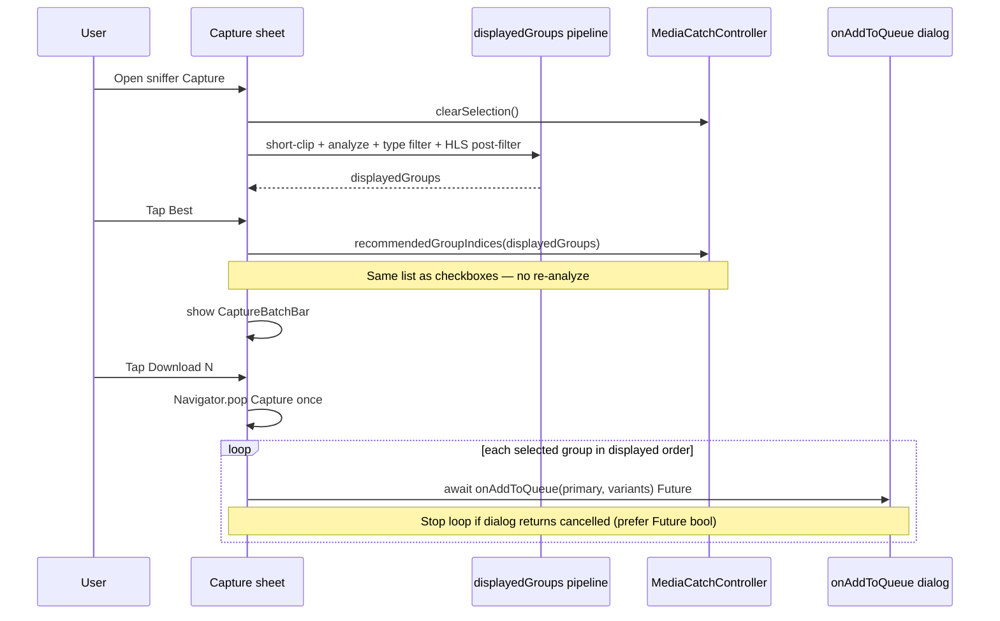

# Full Capture Sheet Redesign (Light + Dark Mode)

| Field | Value |
|---|---|
| **Author** | Design agent (Grok Build) |
| **Date** | 2026-07-17 |
| **Status** | Draft (rev 4 — product Open Questions closed) |
| **Branch** | `Post-Gate-Production` only |
| **Primary surface** | Capture / catch sheet (`showSniffedMediaSheet`) |
| **Supersedes** | Token-only design `grok-design-doc-486cda2d.md` (contrast patch only) |
| **User request** | *"redesign capture sheet both light and dark mode!"* |
| **Expected effort** | **5 required PRs** (~**4–5.5 eng-days** total); **PR3 is bulk (~1.5–2.5 days)**; **PR5 required** for sort/display Options (~0.5 day); UI-only; debug APK QA. Batch + product OQs locked below. |

---

## Overview

The Capture sheet is the product’s primary “catch media” surface: a tall bottom sheet listing sniffed videos, audio, HLS, torrents, and images with filters, Best-quality selection, per-row preview/download/info, and live updates from the sniffer stream. Today it is a **dense, partially-migrated dark UI** with hard-coded Material colors (`Colors.white`, `Colors.tealAccent`, `Colors.blue`, …). In light mode the header vanishes (white on white), neon accents glare on snow, and the journey into Details (`media_info_sheet.dart`) re-enters the same dark-only paint.

A prior design (id `486cda2d`) proposed a mechanical `context.ac` map only. That is necessary but **not sufficient**: visual hierarchy is weak, list rows are ad-hoc inline widgets, recommended groups have no on-row affordance, multi-select has no sticky batch action (yet the list pads `bottom: 80` as if a bar existed), and light media-type hues still collide after token mapping. The user asked for a **real redesign** of layout, hierarchy, components, interaction polish, and theme-correct colors **together** for both themes.

This document specifies a cohesive Capture system: extracted widgets, a clear zoned layout, theme-aware media accents (with light-palette differentiation), a sticky selection/action bar, and same-journey theming for Media Info. Functional behavior (filters, Best, Clear, Rescan, select, preview, download, info, stream rebuilds) is preserved; sniffer/analyzer logic stays out of scope except for a documented **selection-index + visible-list pipeline fix** required to make Best and batch download correct.

---

## Background & Motivation

### Surfaces inventory

| Layer | Path | Status |
|---|---|---|
| Live Capture UI | `lib/sniffer/sheets/sniffed_media_sheet.dart` | **Primary redesign target** — `showSniffedMediaSheet`, `buildCatchSheetHeader`, `compactFilterChip`, inline list rows, `_CaptureStatChip`, `_accentFor` |
| Part file (mixed) | `lib/sniffer/widgets/capture_widgets.dart` (`part of` sniffer_screen) | **Live:** `_BrowserDock`, `_CompactNavButton`, `_DockDot` — **do not break**. **Dead:** `_CaptureMediaTile`, `_CaptureActionBar`, `_SniffedMediaControls`, `_MiniPill`, `_FilterChip`, `_Badge`, part-file `_CaptureStatChip` |
| Dead screen wrappers | `sniffer_screen.dart` ~5553–5605 | `_buildCatchSheetHeader`, `_compactFilterChip`, `_filteredGroups`, `_selectedGroups`, `_recommendedCaptureIndices`, `_captureMetadataLabel` — **not used by live `showSniffedMediaSheet` path**; re-express flat-index Best if revived; delete or align in PR1 |
| Media details | `lib/sniffer/sheets/media_info_sheet.dart` | Same journey (row Info / body tap); heavy `Colors.white*` hardcodes — **token/contrast only in PR4**, not structural redesign |
| Media preview | `lib/sniffer/sheets/media_preview_sheet.dart` | Routes to `AuroraVideoPlayer` / `MediaPreviewWidget` — **out of Capture chrome redesign** |
| Controller | `lib/sniffer/controllers/media_catch_controller.dart` | Selection, filters, `recommendedCaptureIndices`, `selectedGroups` |
| Analyzer | `lib/sniffer/media_capture_analyzer.dart` | Groups, quality labels, `isRecommended`, hidden reasons |
| Theme | `lib/theme/aurora_tokens.dart`, `aurora_palette.dart`, `aurora_theme.dart` | `AColors` dual factories; `context.ac`; **`BottomSheetThemeData` already sets `backgroundColor` / `modalBackgroundColor` = `surfacePanel`** for both modes |
| Host download | `sniffer_screen.dart` → `_showAddQueueDialog` | Capture `onAddToQueue` always opens Add-to-queue **modal dialog** (no silent multi-enqueue on this path today). Live sheet types it as **`void Function(...)`** which **discards** the host’s `Future<void>` — see Key Decisions 13 + 23. Separate `_enqueueDirectDownload` exists for other entry points — **not** used by Capture v1 batch |
| Reference sheets | `group_actions_sheet.dart`, `tabs_sheet.dart`, `favorites_sheet.dart` | Correct `textPrimary` / `accentFrost` / `surfaceField` patterns |

### Current layout (as implemented)



### Pain points (product + engineering)

1. **Light mode broken** — header title/subtitle white on white; neon Material accents on snow.
2. **Partial token migration** — filter chips and some list text use `context.ac`; header, stats, checkbox, quality pill, download icon, type accents do not.
3. **Weak hierarchy** — single cramped header row packs icon + two text lines + three actions; no visual zones; stats and filters compete for attention.
4. **Inconsistent card language** — inline rows vs dead `_CaptureMediaTile` (leading rail, recommended pill, host line, vertical actions) — dual implementation; live path is the weaker one.
5. **Light media hierarchy collapses** after naive mapping:
   - light: `accentFrost` = `mediaVideo` = `mediaOther` = `#3D6C9A`
   - light: `mediaHls` = `accentAmber` = `#A35A00`
6. **Selection UX incomplete** — checkboxes + Best work, but there is **no batch download bar** despite `bottom: 80` padding and a fully built (dead) `_CaptureActionBar`. Multi-select currently feels purposeless beyond Best.
7. **Selection model bug (index space)** — live list stores **group indices** in `selectedIndices`; `recommendedCaptureIndices` / `selectedGroups` treat indices as **flat candidate indices** (historic “flat card layout” comments). Concrete failure: checking **group 1** can make `selectedGroups` return the **second candidate of group 0** (and skip the intended group’s primary). Best can set candidate-slot indices that only partially light checkboxes. Redesign unifies on **group index into the currently displayed list**.
8. **Best path pipeline divergence (call-site)** — even after group-index rewrite, live Best **re-analyzes** via `analyze(sortMedia(detectedMedia))` without:
   - filtering `!m.isShortClip` (display path does),
   - applying the **HLS segment post-filter** when `currentSegment == MediaFilter.hls` (display path does; and on HLS chip `activeFilter` is forced to `null`, so controller `filteredGroups` alone is not enough).
   Best can therefore recommend groups the user cannot see (or miss short-clip exclusion). Fix: **selection index space = indices into the already-built displayed `filteredGroups` list** (single source of truth in the sheet builder).
9. **Recommended state invisible on rows** — analyzer marks `isRecommended`; live UI only uses it via the Best button, never as an on-row badge.
10. **Journey half-broken** — Details sheet still dark-hardcoded after Capture is fixed.
11. **Metadata parity gaps** — live `_sizeText` never prefixes `~` for `isSizeEstimated` (controller `captureMetadataLabel` does); live row omits **variant count** that dead tile / controller label surface.

### Why not “just map colors”

Token mapping restores readability. It does **not**:

- Fix cramped header / weak empty state / missing batch bar
- Give light mode a distinct media-type language
- Remove dual implementations
- Fix selection-index semantics **and** Best pipeline parity
- Align Capture with polished sheets (`group_actions_sheet`, tabs)

User feedback after the color-only design intent was explicit: redesign both modes.

---

## Goals & Non-Goals

### Goals

1. **Polished dual-theme Capture sheet** — intentional light *and* dark compositions (not inverted dark chrome).
2. **Clear layout structure** — zoned header, filters, options, stats, list, sticky actions, empty state.
3. **Consistent Aurora language** — Nord glass/frost via `AColors` / `context.ac`; no leaf-level `Colors.white` / Material primaries on Capture chrome.
4. **Distinct media-type hierarchy in both themes** — including light-mode token adjustments where collisions make types unreadable.
5. **Extract reusable components** — `CaptureMediaRow`, `CaptureSheetHeader`, filter/stats/batch/empty widgets; kill dead dual path surgically.
6. **Complete multi-select journey** — sticky batch bar when selection non-empty; Select all / Clear / Download selected with **locked host behavior** (Key Decision 13).
7. **Preserve all live behaviors** — filters, Best, Clear, Rescan, show-all, stream rebuild, preview, download (with variants), info.
8. **Fix selection semantics end-to-end** — group indices into the **displayed** list; Best / Select all / batch share that list (not a re-analyze path).
9. **Same-journey Media Info theming** — Details opened from Capture must be theme-correct (**token/contrast only**).
10. **Accessibility** — AA contrast on primary surfaces where feasible; usable touch targets with an explicit **narrow-width density strategy** (not naive 44×3 overflow); semantics labels.
11. **Incremental, reviewable PRs** — each mergeable; debug APK only for QA.
12. **Re-expose sort + display-mode controls in the Options zone** — wire existing `DownloadSettings.sniffedMediaSort` / `sniffedMediaDisplayMode` (persisted today; UI dead) into Capture (**required PR5**).

### Non-Goals

- Changing sniffer detection, enricher, worker pool, or analyzer scoring (except consuming `isRecommended` / quality labels already produced).
- Redesigning browser dock (`_BrowserDock`) or dock order.
- Fullscreen player / `media_preview_sheet` visual overhaul (functional path stays).
- **Media Info structural redesign** (section layout, variant picker UI, new fields) — **out of scope**. PR4 is hardcode→token + type-chip color only; “aligned with Capture” means **token discipline and readable hierarchy**, not a second full redesign.
- Global ThemeData / ColorScheme seed rewrite beyond Capture-needed media tokens.
- **Silent multi-enqueue** / new `_enqueueDirectDownload` Capture path — **deferred** (optional later PR only; v1 sequential dialogs sufficient).
- Release builds, Pro/freemium gates, adblock.
- New persistence formats — sort/display/show-all already persist via `DownloadSettings`; no schema migration.
- Pixel-perfect Samsung/1DM clone — Aurora identity over competitor mimicry.
- **Show-all copy rewrite** — keep current live strings (Key Decision 26).

---

## Proposed Design

### Design principles

| Principle | Application |
|---|---|
| **Surface roles, not absolute paint** | Text → `text*`; actions → `accentFrost` / `accentAmber` / `statusError`; types → `media*` |
| **Zone the sheet** | Header · Filters · Options · Stats · List · Sticky bar — each with fixed spacing scale |
| **One row component** | Single `CaptureMediaRow` owns all row states (idle / selected / recommended) |
| **Selection is group-scoped on the displayed list** | One checkbox per capture group; indices are positions in **that** `List<CaptureGroup>` only |
| **Single pipeline for Best / Select all / batch** | Never re-analyze without short-clip + segment filters; pass the built list into helpers |
| **Sticky utility, not always-on chrome** | Batch bar appears only when `selectedCount > 0` |
| **Light ≠ inverted dark** | Light uses snow panels, hairline borders, deepened accents; dark keeps Nord glass gradients |
| **Reference, don’t reinvent** | Match `group_actions_sheet` / `tabs_sheet` header + token discipline |

### Architecture (target)



### Visible-list pipeline (single source of truth)

All selection operations (checkbox, Best, Select all, batch download) operate on **one list** built once per rebuild:

```dart
// Pseudocode — sheet builder (must be the only path for Best)
List<SniffedMedia> allMedia = sortMedia(tab.snifferEngine.detectedMedia)
    .where((m) => !m.isShortClip)
    .toList();

final captureResult = mediaCatchController.analyze(allMedia);

// Sync type filter for controller helpers that still read activeFilter
mediaCatchController.activeFilter = _mediaTypeForFilter(currentSegment);

List<CaptureGroup> displayedGroups =
    mediaCatchController.filteredGroups(captureResult.groups);

// HLS segment is NOT a MediaType — post-filter after controller filter
if (currentSegment == MediaFilter.hls) {
  displayedGroups = displayedGroups
      .where((g) =>
          isHlsMedia(g.primary.media) ||
          g.candidates.any((c) => isHlsMedia(c.media)))
      .toList(growable: false);
}

// Selection index space:
// selectedIndices ⊆ {0 .. displayedGroups.length - 1}
```

| Operation | Correct input | Forbidden |
|---|---|---|
| Checkbox toggle | `index` into `displayedGroups` | Flat candidate globalIdx |
| Best | `recommendedGroupIndices(displayedGroups)` — **pass this list in**, do not re-analyze | `analyze(sortMedia(detectedMedia))` without short-clip / HLS post-filter |
| Select all | `selectAll(displayedGroups.length)` | Different count than list |
| Batch download | map selected indices → `displayedGroups[i]` | `selectedGroups` that re-filters / re-indexes candidates |

Controller helpers should prefer overloads that take the **already-filtered** list and **do not** call `filteredGroups` again (or document that callers must pass the displayed list and helpers only index into it):

```dart
/// Indices into [visibleGroups] (already short-clip + type + HLS filtered).
Set<int> recommendedGroupIndices(List<CaptureGroup> visibleGroups) {
  return {
    for (var i = 0; i < visibleGroups.length; i++)
      if (visibleGroups[i].isRecommended) i,
  };
}

List<CaptureGroup> selectedFrom(
  List<CaptureGroup> visibleGroups,
  Set<int> selectedIndices,
) {
  return [
    for (var i = 0; i < visibleGroups.length; i++)
      if (selectedIndices.contains(i)) visibleGroups[i],
  ];
}
```

**Live Best handler today (broken call site)** — `sniffed_media_sheet.dart` `onSelectBest` re-runs analyze on sorted media **without** `!isShortClip` and **without** HLS post-filter. PR1 **must** change this call site (and delete/align dead `sniffer_screen` wrappers that copy the same mistake).

### Sheet structure (target)



**Sheet chrome**

| Property | Value |
|---|---|
| Modal | `showModalBottomSheet` + `DraggableScrollableSheet` |
| Sizes | `initial 0.90`, `min 0.30`, `max 1.0`, snap `[0.3, 0.5, 0.9, 1.0]` (keep) |
| Background | Inherit theme `surfacePanel` (already set in `aurora_theme.dart`); optional explicit `backgroundColor: context.ac.surfacePanel` for local clarity — **not a product fork** |
| Drag handle | system `showDragHandle: true` |
| Safe area | `useSafeArea: true` on modal |
| Scroll | See **Layout contract** below |

### Layout contract (DSS + sticky batch bar)

**Recommended structure (single choice — Column, not Stack):**

```text
DraggableScrollableSheet(
  builder: (context, scrollController) {
    return Column(
      children: [
        Expanded(
          child: CustomScrollView(
            controller: scrollController, // DSS owns THIS controller only
            physics: const ClampingScrollPhysics(),
            slivers: [
              // Header, filters, options, stats as SliverToBoxAdapter
              // List or empty as SliverList / SliverFillRemaining
            ],
          ),
        ),
        if (selectedCount > 0)
          CaptureBatchBar(...), // sticky, outside scroll
      ],
    );
  },
)
```

| Rule | Spec |
|---|---|
| **Controller ownership** | Attach DSS `scrollController` **only** to the `CustomScrollView` (or primary scrollable). Never attach it to a parent that also scrolls. |
| **What scrolls** | Header, filters, options, stats, and list are **all slivers** — they scroll away together. Do **not** pin header above `Expanded` in v1 (simpler; avoids dual scroll ownership). |
| **Batch bar placement** | Sibling **below** `Expanded` scroll view inside the DSS child `Column`. Not inside slivers; not `Positioned` Stack overlay in v1. |
| **Safe area** | Modal already `useSafeArea: true`. Batch bar padding: `EdgeInsets.fromLTRB(12, 8, 12, 12)` **without** adding a second full `SafeArea` wrapper. If home indicator still clips on a device, add **only** `padding: EdgeInsets.only(bottom: MediaQuery.viewPaddingOf(context).bottom)` on the bar — never nest `SafeArea` on both modal and bar. |
| **Bar appear/disappear** | When `selectedCount` goes 0→N, bar inserts and **reduces** `Expanded` height (content reflows). Prefer simple conditional build; optional `AnimatedSize` (duration ~150ms). Expect minor list jump — acceptable; do not resize DSS fraction. |
| **Bottom padding of list** | Remove legacy `SliverPadding(bottom: 80)`. When bar hidden, list can use `bottom: 12`; when bar visible, bar height provides clearance. |
| **Drag smoke test** | With bar visible: drag sheet between snap sizes; scroll list to end; no gesture arena fight (scroll vs drag). |

**Rejected for v1:** `Stack` + `Positioned(bottom:)` floating bar (overlays last rows unless extra list padding is always reserved — reintroduces the old `bottom: 80` smell).

---

## Visual Design Spec

### Component inventory

| Component | File (proposed) | Responsibility |
|---|---|---|
| `showSniffedMediaSheet` | `sheets/sniffed_media_sheet.dart` | Orchestration, **displayedGroups pipeline**, controller wiring, stream rebuild |
| `CaptureSheetHeader` | `capture/capture_sheet_header.dart` | Title, subtitle, Rescan / Best / Clear |
| `CaptureFilterBar` | `capture/capture_filter_bar.dart` | Horizontal type chips (`MediaFilter`) |
| `CaptureOptionsRow` | `capture/capture_options_row.dart` | Show-all toggle + sort + display-mode dropdowns (PR5) |
| `CaptureStatsRow` | `capture/capture_stats_row.dart` | Aggregate pills |
| `CaptureMediaRow` | `capture/capture_media_row.dart` | One group row + states + density strategy |
| `CaptureBatchBar` | `capture/capture_batch_bar.dart` | Multi-select sticky actions |
| `CaptureEmptyState` | `capture/capture_empty_state.dart` | Empty illustration + copy |
| `mediaAccentFor` | `capture/media_accent.dart` | Pure type → color helper |
| `MediaFilter` enum | stay on sheet library or move to `capture/media_filter.dart` | Filter segment values |

**Do not** implement these as new types inside `capture_widgets.dart` part file. New Capture UI is a normal library under `lib/sniffer/capture/` so it is testable without `sniffer_screen.dart`.

**Dead code disposition (PR hygiene):** surgically delete dead Capture leftovers in `capture_widgets.dart`; **never** delete the part file or dock types. PR1 also removes or aligns dead selection wrappers on `sniffer_screen.dart`.

### CaptureSheetHeader anatomy

```
┌─────────────────────────────────────────────────────────────┐
│  [frost icon well 36²]  Media on this page          [⟳][✦][🗑] │
│                         2 selected · 14 shown                 │
└─────────────────────────────────────────────────────────────┘
```

| Element | Spec |
|---|---|
| Icon well | 36×36, radius 10, fill `accentFrost @ 0.12`, icon `Icons.radar` or `filter_alt` size 20, color `accentFrost` |
| Title | 18 / w800 / `textPrimary` / height 1.2 — “Media on this page” |
| Subtitle | 12 / w400 / `textSecondary` — empty: “Browse to find downloadable media”; else: “$selected selected · $shown shown” |
| Rescan | `IconButton` min 40×40, `Icons.refresh_rounded`, `accentFrost`, tooltip “Rescan page for new media” |
| Best | `TextButton.icon` or compact pill: `auto_awesome` + “Best”, color `accentAmber`, disabled when `shown==0`, key `capture_select_best_button` |
| Clear | `IconButton`, `delete_sweep`, `statusError`, disabled when empty, tooltip “Clear all detected media” |
| Padding | `fromLTRB(16, 4, 8, 12)` |
| Divider under header | optional 1px `borderHairline` full width |

**Dark:** icon well on glass panel reads as soft glow.  
**Light:** same structure; frost is deep Nordic blue (`#3D6C9A` today) — readable on white.

### CaptureFilterBar anatomy

Keep pill chips (current `compactFilterChip` is the right language); extract and enhance:

| State | Background | Border | Icon/Text |
|---|---|---|---|
| Unselected | `glassSurface` (dark) / `surfaceElevated` (light) | `glassBorder` | `textSecondary` |
| Selected (All) | `accentFrost @ 0.16` | `accentFrost` | `accentFrost`, w600 |
| Selected (type) | `mediaAccent @ 0.14` | `mediaAccent` | `mediaAccent`, w600 |

Type-specific selected accent (Video→`mediaVideo`, …) improves scannability vs all-frost selection. “All” stays frost.

| Chip | Icon | Filter |
|---|---|---|
| All | `all_inclusive` | `MediaFilter.all` |
| Video | `movie` | video |
| Audio | `audiotrack` | audio |
| HLS | `queue_music` | hls |
| Torrent | `hub` | torrent |
| Image | `image` | image |

Spacing: chip padding `H10 V6`, radius 14, gap 6, bar padding `H12 V4`.

### CaptureOptionsRow (show-all + sort + display mode)

**In scope (Key Decisions 25–26).** Expand the Options zone beyond the show-all switch: re-expose sort and display-mode controls that already exist in settings/backend but only in dead UI (`_SniffedMediaControls` in `capture_widgets.dart`).

#### Existing data (no new schema)

| Setting | Type | Storage | Backend consumer today |
|---|---|---|---|
| `captureShowAllMedia` | `bool` | `DownloadSettings` JSON | `MediaCatchController.captureShowAllMedia` / sheet switch |
| `sniffedMediaSort` | `SniffedMediaSort` enum: `newest`, `name`, `type`, `size`, `duration` | `DownloadSettings` JSON | `SnifferScreen._sortedMedia` → passed as `sortMedia` into sheet |
| `sniffedMediaDisplayMode` | `SniffedMediaDisplayMode` enum: `size`, `duration`, `both` | `DownloadSettings` JSON | `SnifferScreen._metadataLabel` (queue/other); **live Capture row builds its own subtitle** — PR5 must honor mode in `CaptureMediaRow` |

Defaults: `SniffedMediaSort.newest`, `SniffedMediaDisplayMode.both` (`download_settings.dart`).

Sheet already receives `settings` + `onSettingsChanged` — use them; do not invent parallel state.

#### Anatomy

```
[ show-all SwitchListTile / compact row — CURRENT COPY ]
[ Sort by ▾ newest|name|type|size|duration ]  [ Meta ▾ size|duration|both ]
```

**Show-all copy — keep current live strings exactly (KD26):**

| Element | Copy |
|---|---|
| Title | `Show all captured media` |
| Subtitle when off | `Show only URLs that look like playable media` |
| Subtitle when on | `Show every detected URL, including non-media assets` |
| Key | `capture_show_all_switch` |

Do **not** reframe to “Show only playable media” as the title.

**Sort / display dropdowns** (tokenized; resurrect pattern from dead `_SniffedMediaControls`):

| Control | Binding | On change |
|---|---|---|
| Sort by | `settings.sniffedMediaSort` | `onSettingsChanged(settings.copyWith(sniffedMediaSort: v))` then `setSheetState` so list re-sorts via existing `sortMedia` |
| Meta / Show type | `settings.sniffedMediaDisplayMode` | `onSettingsChanged(...displayMode:)` + rebuild rows so subtitle recipe respects mode |

Dropdown chrome: `DropdownButtonFormField` with `context.ac` labels / borders (or theme InputDecoration); dense; horizontal row with two `Expanded` children (same layout as dead control). Labels: “Sort by” / “Show type” (or “Meta”) as today.

**Display mode vs subtitle recipe (PR5):**

| Mode | Size in subtitle | Duration in subtitle |
|---|---|---|
| `size` | yes (`~` if estimated) | omit |
| `duration` | omit | yes if known |
| `both` | yes | yes |

Resolution, HLS/content-type, variant count remain independent of display mode (always eligible when present).

Toggle colors: active track `accentFrost`. Padding `fromLTRB(12, 0, 12, 8)`.

### CaptureStatsRow

Horizontal scroll of soft pills (existing `_CaptureStatChip` shape, redesigned colors):

| Chip | Icon | Color role |
|---|---|---|
| `$n found` | `link` | **`textSecondary`** (neutral aggregate — never frost/video) |
| `$n video` | `movie` | `mediaVideo` |
| `$n audio` | `audiotrack` | `mediaAudio` |
| size if >0 | `storage` | `textSecondary` |
| `$n filtered` | `visibility_off` | `textTertiary` |

Pill anatomy: fill `color @ 0.12`, border `color @ 0.28`, radius 16, icon 14, label 12 w600, padding H10 V5, gap 8.

Optional later: HLS / torrent counts if product wants denser stats (not required for v1 redesign).

### CaptureMediaRow anatomy

```
┌─ selected border frost 2px / else hairline 1px ─────────────────────┐
│ ▌ ☐  [icon well]  Title title title…          [q] [Best]  ▶  ↓  ℹ   │
│ │                 ~12.3 MB · 1920x1080 · 3:24 · HLS · 3 variants     │
└─────────────────────────────────────────────────────────────────────┘
  ^4dp accent rail (media type)
```

| Slot | Spec |
|---|---|
| Accent rail | width 4, full height, color `mediaAccentFor(...)`, left only |
| Checkbox | M3 `fillColor` selected → `accentFrost`; check → `onPrimary`; min visual control **40×40** (see density strategy) |
| Icon well | 40×40, radius 10, fill `accent @ 0.14`, icon 22 `mediaIcon(type)` |
| Title | 13–14 w600 `textPrimary`, maxLines 2, ellipsis; fallback “Unknown media”; wrap in `Expanded`/`Flexible` |
| Quality pill | if qualityLabel non-empty and ≠ `HLS`: fill `accentFrost @ 0.12`, text 10 w700 `accentFrost`, radius 4, pad H5 V1 |
| Best pill | if `group.isRecommended`: `auto_awesome` + “Best”, `accentAmber` well |
| Subtitle | see **ordered metadata recipe** below |
| Preview | video/audio/image only; key `preview_item_$i` |
| Download | key `download_item_$i` |
| Info | key `info_item_$i` |
| Card fill | **Dark:** gradient `gradientMid → surfacePanel`. **Light:** solid `surfaceCard` + `borderHairline` |
| Selected | border `accentFrost` 2px + soft glow `accentFrost @ 0.20` blur 8 (dark) / `@ 0.12` blur 6 (light) |
| Padding | outer `H12 V4`; inner content pad `L0 T8 R8 B8` |
| InkWell | body tap → `onInfo` (**Key Decision 15**); checkbox selects without opening info |

#### Subtitle / metadata recipe (ordered)

Join non-empty parts with ` · ` (U+00B7):

1. **Size** — from `contentLengthBytes`; if null/≤0 omit. If `item.isSizeEstimated`, prefix `~` (e.g. `~12.3 MB`). Prefer sharing logic with `MediaCatchController.captureMetadataLabel` / a tiny pure helper — **live `_sizeText` today never emits `~`**; redesign fixes that parity gap.
2. **Resolution** — if `width` and `height` non-null: `${w}x${h}`.
3. **Duration** — if `duration` non-null and `inSeconds > 0`: `MM:SS` / `H:MM:SS`.
4. **HLS or content-type** — if HLS: `HLS`; else short content-type (strip parameters).
5. **Variant count** — if `group.variantCount > 1`: `$n variants` (dead tile / controller already surface this; live row does not — **add in redesign**).

**Out of v1:** host line from `sourcePageUrl` (dead `_CaptureMediaTile` had it). Details sheet remains the place for full URL/host.

#### Narrow-width density strategy (required for PR3)

Live rows use **28×28** compact icon buttons because 360dp phones are tight. Naive **44×44 × (checkbox + 3 actions)** + 40 well + rail + pills **will overflow**.

| Breakpoint | Strategy |
|---|---|
| **Default (≥360dp width)** | Checkbox hit target **40×40** (Material compromise vs 44; icon 20). Trailing actions: **40×40** min (`IconButton` with `constraints: BoxConstraints(minWidth: 40, minHeight: 40)`, icon size 20–22). No `VisualDensity.compact` that shrinks below 40. |
| **Narrow (&lt;360dp logical width)** | Keep checkbox 40. Collapse **Preview** into trailing **`PopupMenuButton`** (`more_vert`) with items: Preview (if applicable), Download, Details. Show **one** visible primary CTA = Download icon still inline if space allows; otherwise all three in menu. Measure with `LayoutBuilder` / `MediaQuery.sizeOf(context).width`. |
| **Pills** | Max **two** inline pills on row 1 with title: Quality (if any) + Best (if recommended). If both would overflow title (`Flexible` title gets min 80dp), drop Quality first (Best stays when recommended). Do **not** wrap pills under title in a second chip row in v1 (height cost). |
| **Semantics** | Regardless of size, each action has `tooltip` / `Semantics(label: …)`. |
| **AA note** | 40dp is below WCAG 2.2 44dp ideal; accepted as **density compromise** with tooltips + large enough icons. Prefer 44 where width ≥400 if free space exists (optional progressive enhancement). |

### CaptureEmptyState

```
        [large radar/movie icon 48 — textTertiary]
        No media detected on this page
        Play a video or scroll further so Aurora can catch streams.
        [optional text button: Rescan]
```

| Element | Spec |
|---|---|
| Icon | 48, `textTertiary` |
| Title | 16 w600 `textPrimary` |
| Body | 13 `textSecondary`, center, max width 280 |
| Rescan | text button `accentFrost` calling same `onRescan` |
| Vertical center | `SliverFillRemaining` |

### CaptureBatchBar (sticky)

Shown only when `selectedCount > 0`:

```
┌──────────────────────────────────────────────────────────────┐
│  [Select all / Clear]   N selected          [⬇ Download N]   │
└──────────────────────────────────────────────────────────────┘
```

| Element | Spec |
|---|---|
| Surface | `surfaceElevated` (dark) / `surfacePanel` + top `borderHairline` + light elevation shadow (light) |
| Safe bottom | per Layout contract (no double SafeArea) |
| Select all | key `capture_select_all_button`; toggles all **displayed** group indices via `selectAll(displayedGroups.length)` / `clearSelection` |
| Count | 13 `textSecondary` |
| CTA | filled pill: gradient `accentFrost → mediaVideo` (tokenized, **no raw hex**), label “Download $n”, icon/label color `onPrimary`, key `batch_download_btn` |

#### Batch download host behavior — **locked v1** (Key Decision 13)

Host today: `onAddToQueue` → `_showAddQueueDialog` (`Future<void>` modal). There is **no** silent multi-enqueue on the Capture path. Per-row download does `Navigator.pop(captureSheet)` then dialog.

**API prerequisite (Key Decision 23 — required for sequential batch):**  
Live `showSniffedMediaSheet` types:

```dart
// TODAY (broken for sequential batch)
required void Function(
  BuildContext context,
  SniffedMedia media, {
  List<SniffedMedia> variants,
}) onAddToQueue,
```

Host already returns a Future that is discarded:

```dart
// sniffer_screen.dart today
onAddToQueue: (ctx, media, {variants = const []}) =>
    _showAddQueueDialog(ctx, media, variants: variants),
// _showAddQueueDialog is Future<void> — Future is dropped by void Function
```

**Change in PR3** (small intentional signature change — not a no-op “keep void”):

```dart
// TARGET
required Future<void> Function(
  BuildContext context,
  SniffedMedia media, {
  List<SniffedMedia> variants,
}) onAddToQueue,
```

Host wiring becomes explicit async:

```dart
onAddToQueue: (ctx, media, {variants = const []}) =>
    _showAddQueueDialog(ctx, media, variants: variants),
// return type Future<void> now matches; can be awaited
```

Per-row download may still fire-and-forget (`unawaited(onAddToQueue(...))` or ignore the future after pop) — only **batch** must await.

**v1 algorithm (implement this; do not invent silent enqueue):**

1. Resolve `selected = selectedFrom(displayedGroups, selectedIndices)` (same list as UI).
2. If empty, no-op.
3. **`Navigator.pop` the Capture sheet once** (same as per-row — user leaves Capture before dialogs). Capture a `parentContext` that remains valid after pop (existing pattern).
4. For each `group` in `selected` **in list order**:
   ```dart
   await onAddToQueue(
     parentContext,
     group.primary.media,
     variants: group.candidates.map((c) => c.media).toList(),
   );
   ```
5. **Always pass full variant list** (mirror per-row download) — Key Decision 14.
6. **Cancel / dismiss policy:** If the user **cancels** an Add-to-queue dialog (dialog returns without enqueue), **stop the loop** — do not open remaining dialogs for later selected groups. Implement by having `_showAddQueueDialog` complete normally on cancel (still `Future` completes) **and** return a bool, **or** simpler v1: treat any dialog completion as “done with this item” and **continue** the loop only if we cannot distinguish cancel.

   **Locked v1 cancel rule (pick the implementable default without host redesign):**  
   - Prefer: change `_showAddQueueDialog` to `Future<bool>` (true = enqueued / confirmed, false = cancelled) and stop the batch loop on `false`.  
   - If that host change is deferred in the same PR, **continue** through remaining groups after each dialog closes (cancel still advances) — document as degraded UX; **do not** fire all dialogs concurrently.

7. **Never** call `onAddToQueue` in a non-awaited loop for N&gt;1 (no concurrent modals).

**Known limitation:** N&gt;1 yields sequential Add-to-queue dialogs. **Product confirmed sufficient for v1 (KD27)**; optional later PR6 may add silent multi-enqueue — **not** redesign-blocking.

### Color / token tables

#### Surfaces & text (both modes — existing)

| Role | Dark | Light | Capture use |
|---|---|---|---|
| `surfaceField` | `#0A0F14` | `#F4F6FA` | Optional sheet outer |
| `surfacePanel` | `#141B23` | `#FFFFFF` | Sheet background (theme default already) |
| `surfaceCard` | `#18212B` | `#FFFFFF` | Light row fill |
| `surfaceElevated` | `#1F2B38` | `#E5E9F0` | Batch bar, unselected chip (light) |
| `glassBorder` / `borderHairline` | white @6–8% | `#2E3440` @10% | Row borders |
| `textPrimary` | `#E5E9F0` | `#2E3440` | Titles |
| `textSecondary` | `#9AA7B3` | `#4C566A` | Subtitles, aggregates |
| `textTertiary` | `#6C7A89` | `#6C7A89` | Filtered chip, empty icon |
| `accentFrost` | `#88C0D0` | `#3D6C9A` | Primary actions, selection |
| `accentAmber` | `#EBCB8B` | `#A35A00` | Best |
| `statusError` | `#BF616A` | `#A12D2D` | Clear |

#### Media type accents — **proposed differentiation** (rev 2 — stronger separation)

Today’s light collisions break type scannability. Media\* fields are **unused outside `aurora_tokens.dart` today** (blast radius near zero). Redesign includes a small palette PR:

| Role | Dark | Light **today** | **Proposed** | Rationale |
|---|---|---|---|---|
| `mediaVideo` | `#5E81AC` (keep) | `#3D6C9A` (= frost) | Light **`#1E5A8C`** | Clearly cooler/deeper than frost `#3D6C9A`; not a 1-step nudge |
| `mediaAudio` | `#B48EAD` | `#8F6A85` | keep both | Distinct purple |
| `mediaImage` | `#4F7A3A` | `#4F7A3A` | keep | Distinct green |
| `mediaHls` | `#D08770` (keep) | `#A35A00` (= amber) | Light **`#C45C3E`** | Coral/rust; ≠ amber Best |
| `mediaOther` | `#3D6C9A` (keep) | `#3D6C9A` | Light **`#5A6B7D`** | Neutral slate; not frost |
| `mediaTorrent` **NEW** | **`#3D8B84`** (deeper teal) | **`#2F6F6F`** | Deep Nord teal | **Not** amber; **not** frost-cyan `#88C0D0` — deeper than rev-2 `#8FBCBB` so dark type ≠ primary action frost |
| `accentFrost` | `#88C0D0` | `#3D6C9A` | keep | Primary actions |
| `accentAmber` | `#EBCB8B` | `#A35A00` | keep | Best / warnings only |

**Approximate contrast (icon-sized accents on light `surfacePanel` `#FFFFFF`):**

| Hex | Role | Approx contrast vs white | Note |
|---|---|---|---|
| `#1E5A8C` | mediaVideo light | ~6.5:1 | Passes AA for normal text |
| `#3D6C9A` | accentFrost light | ~5.2:1 | Passes AA |
| `#C45C3E` | mediaHls light | ~4.6:1 | Borderline AA; use with icon well + label |
| `#2F6F6F` | mediaTorrent light | ~5.4:1 | Passes AA |
| `#5A6B7D` | mediaOther light | ~4.9:1 | Passes AA for large / UI |

**Dark QA note:** If `#3D8B84` torrent still feels close to frost on glass, nudge further toward `#2F6F6F` family rather than toward cyan. Color is **not** the only channel — always pair with type icons.

#### Hardcode → role map (live path)

| Hardcode today | Role |
|---|---|
| `Colors.white` titles | `textPrimary` |
| `Colors.white70` | `textSecondary` |
| `Colors.tealAccent` / `cyanAccent` / `teal` | `accentFrost` (actions) or media role (type) |
| `Colors.amber` (Best) | `accentAmber` |
| `Colors.redAccent` | `statusError` |
| `Colors.orange` (HLS) | `mediaHls` |
| `Colors.blue` (video) | `mediaVideo` |
| `Colors.purple` (audio) | `mediaAudio` |
| `Colors.green` (image) | `mediaImage` |
| `Colors.amber` (torrent) | PR1: `mediaOther` (compile-safe); PR2+: `mediaTorrent` |
| `Colors.grey` / `blueGrey` | `textTertiary` / `textSecondary` |
| `Colors.white` checkbox check | `auroraColorScheme.onPrimary` |
| Dead CTA hex `0xFF5E81AC` | `mediaVideo` |

### Typography scale (Capture)

| Token name | Size | Weight | Color role | Use |
|---|---|---|---|---|
| `captureTitle` | 18 | w800 | textPrimary | Sheet header |
| `captureSubtitle` | 12 | w400 | textSecondary | Header meta |
| `rowTitle` | 13 | w600 | textPrimary | Media name |
| `rowMeta` | 11 | w400 | textSecondary | Size/res/duration |
| `chipLabel` | 12 | w400/w600 | secondary/accent | Filters |
| `statLabel` | 12 | w600 | chip color | Stats |
| `pillLabel` | 10 | w700 | accent | Quality / Best |
| `emptyTitle` | 16 | w600 | textPrimary | Empty |
| `emptyBody` | 13 | w400 | textSecondary | Empty |

Prefer explicit `TextStyle` with tokens over `Theme.textTheme` overrides for Capture isolation; match group_actions bold 18 headers.

### Spacing scale

| Token | dp | Use |
|---|---|---|
| `xs` | 4 | tight gaps |
| `sm` | 8 | icon gaps |
| `md` | 12 | section horizontal pad |
| `lg` | 16 | header horizontal |
| `xl` | 24 | empty state pad |
| Row vertical | 4 outer / 8 inner | list density |
| Section gap header→filters | 0–4 | tight |
| Filters→options | 4 | |
| Stats→list | 8–12 | breathing room before cards |
| Touch min (default) | **40** | checkbox + row actions (see density strategy); progressive 44 when width ≥400 |

### Key interaction states

| State | Visual | Interaction |
|---|---|---|
| Idle row | hairline border, no glow | Tap body → Info; checkbox toggles select |
| Selected row | frost border 2px + soft glow | Same; checkbox on |
| Recommended | amber “Best” pill | Independent of selected; Best button selects all recommended **displayed** groups |
| Disabled actions | header Best/Clear when empty | `onPressed: null`, `textDisabled` |
| Filter selected | type-colored or frost pill | Clears selection (current behavior — keep) |
| Live update | stream → `setSheetState` | Preserve `_MediaSheetReBuilder` pattern; recompute `displayedGroups` |
| Batch visible | bar inserts under scroll | AnimatedSize optional |
| Empty | centered empty state | Rescan available |

### Sequence: open Capture → Best → batch download



---

## API / Interface Changes

### Public product API

No user-facing settings / persistence schema change for v1.

### Capture sheet callback — `onAddToQueue` becomes awaitable (PR3)

| | Today | After (PR3) |
|---|---|---|
| Type | `void Function(BuildContext, SniffedMedia, {List&lt;SniffedMedia&gt; variants})` | **`Future&lt;void&gt; Function(...)`** (or `Future&lt;bool&gt;` if cancel-stop is implemented in the same PR) |
| Host | `_showAddQueueDialog` is already `Future&lt;void&gt;` but Future is discarded | Return the Future; batch **awaits** |
| Per-row | `Navigator.pop` then call | Same; may ignore Future |
| Batch | N/A | `await` each call; **never** fire concurrent dialogs |

This is a **small, intentional call-site signature change** (one parameter type + host wiring). It is **not** a product API for end users. Rejected alternatives: keep `void` and race dialogs; invent a second `onBatchAddToQueue` only if Future change is blocked (unnecessary given host is already async).

### Internal helper (new) — **PR1 compile-safe without `mediaTorrent`**

```dart
// lib/sniffer/capture/media_accent.dart  — PR1 lands this exact switch
import 'package:aurora_downloader/sniffer/models/sniffed_media.dart';
import 'package:aurora_downloader/theme/aurora_tokens.dart';

bool isHlsMedia(SniffedMedia m) { /* existing URL/content-type rules */ }

Color mediaAccentFor(AColors ac, SniffedMedia item, {required bool isHls}) {
  if (isHls) return ac.mediaHls;
  return switch (item.type) {
    MediaType.video => ac.mediaVideo,
    MediaType.audio => ac.mediaAudio,
    MediaType.image => ac.mediaImage,
    // PR1: mediaTorrent does not exist yet — use mediaOther (not amber).
    // PR2: change this arm to ac.mediaTorrent only.
    MediaType.torrent => ac.mediaOther,
    _ => ac.mediaOther,
  };
}

IconData mediaTypeIcon(MediaType type) { /* existing _mediaIcon switch */ }
```

**Dependency rule (Key Decision 24):**

| PR | `mediaTorrent` | `mediaAccentFor` torrent arm |
|---|---|---|
| **PR1 alone** | Field **does not** exist; PR1 **must not** reference it | `=> ac.mediaOther` (compiles; residual light hierarchy for torrent until PR2) |
| **PR2** | Adds field + dark/light hexes | Updates **one** switch arm to `=> ac.mediaTorrent` |
| **PR1 \|\| PR2** | Parallel merge order either way | If PR2 merges first, PR1 still uses `mediaOther` until the one-line arm update in PR2 (or a tiny follow-up in PR2) |

**Do not** stub `mediaTorrent` on `AColors` in PR1 unless PR1 and PR2 are intentionally combined — keeps Alternative F (defer palette) valid.

### Selection model (fix — required for batch)

**Contract:** `selectedIndices` are indices into the **currently displayed** `List<CaptureGroup>` (post short-clip, type filter, HLS post-filter).

| API | Today | After |
|---|---|---|
| `toggleSelection(index)` | group index in live UI | keep; document as **displayed-group** index |
| `recommendedCaptureIndices(groups)` | flat candidate indices + re-filters via `filteredGroups` | **`recommendedGroupIndices(visibleGroups)`** — index only; **caller supplies displayed list** |
| `selectedGroups` | flat candidate indexing | **`selectedFrom(visibleGroups, selectedIndices)`** → `List<CaptureGroup>` |
| `selectAll(count)` | 0..count-1 | keep; `count == displayedGroups.length` |

**Concrete regression to test:** two groups G0 (2 candidates) and G1 (1 candidate). Selecting checkbox on row 1 must yield G1’s media, **not** G0’s second candidate.

```dart
// Target semantics — no internal filteredGroups re-entry required
Set<int> recommendedGroupIndices(List<CaptureGroup> visibleGroups) {
  return {
    for (var i = 0; i < visibleGroups.length; i++)
      if (visibleGroups[i].isRecommended) i,
  };
}

List<CaptureGroup> selectedFrom(
  List<CaptureGroup> visibleGroups,
  Set<int> selectedIndices,
) {
  return [
    for (var i = 0; i < visibleGroups.length; i++)
      if (selectedIndices.contains(i)) visibleGroups[i],
  ];
}
```

**PR1 call-site requirement (non-optional):** change live `onSelectBest` in `sniffed_media_sheet.dart` to:

```dart
onSelectBest: () {
  setSheetState(() {
    mediaCatchController.clearSelection();
    mediaCatchController.selectedIndices.addAll(
      mediaCatchController.recommendedGroupIndices(displayedGroups),
    );
  });
},
```

where `displayedGroups` is the **same** local variable used to build the list (including HLS post-filter).

**Dead wrappers on `sniffer_screen.dart`:** delete `_buildCatchSheetHeader`, `_compactFilterChip`, `_filteredGroups`, `_selectedGroups`, `_recommendedCaptureIndices`, `_captureMetadataLabel` if analyzer shows zero references after PR1, **or** rewrite them to the new semantics if something still calls them. Do not leave flat-index Best re-analyze copies around.

### Widget constructor sketch (CaptureMediaRow)

```dart
class CaptureMediaRow extends StatelessWidget {
  const CaptureMediaRow({
    super.key,
    required this.index,
    required this.group,
    required this.selected,
    required this.onSelectedChanged,
    required this.onPreview,
    required this.onDownload,
    required this.onInfo,
  });

  final int index;
  final CaptureGroup group;
  final bool selected;
  final ValueChanged<bool> onSelectedChanged;
  final VoidCallback? onPreview;
  final VoidCallback onDownload;
  final VoidCallback onInfo;
}
```

### `showSniffedMediaSheet` signature

Keep the existing wide **parameter list** for isolation. **One type change in PR3:** `onAddToQueue` → `Future<void> Function(...)` (Key Decision 23). Internally restructure builder body + pipeline + batch CTA.

---

## Data Model Changes

| Change | Detail |
|---|---|
| `AColors.mediaTorrent` | **PR2 only** — new field on `AColors`; set in `dark()` / `light()` factories; update constructor |
| Selection semantics | Controller method behavior only — no persistence |
| No JSON / migration | — |

If PR2 is deferred (Alternative F), torrent rows use **`mediaOther` via `mediaAccentFor`** (PR1 switch arm). No raw hex; no compile dependency on a missing field.

---

## Alternatives Considered

### A. Token-only map (prior design 486cda2d)

| Pros | Cons |
|---|---|
| Small PR, low risk | User already rejected as insufficient; no hierarchy/batch/empty redesign; light type collisions remain |

**Reject** as the full solution; keep its hardcode inventory as implementation checklist inside PR2–3.

### B. Resurrect dead `_CaptureMediaTile` / `_CaptureActionBar` inside part file

| Pros | Cons |
|---|---|
| Some UX already sketched (recommended pill, batch bar) | Still dark-hardcoded; tied to `part of` sniffer_screen; hard to test; dual maintenance |

**Reject.** Port *ideas* into new library widgets; surgically delete dead types.

### C. Full redesign as single mega-PR

| Pros | Cons |
|---|---|
| One visual ship | Hard to review; mixes palette + selection bugfix + info sheet |

**Reject** as merge strategy; vision is full redesign, delivery is incremental PRs.

### D. Always-visible batch bar (even at 0 selected)

| Pros | Cons |
|---|---|
| Discovers multi-select | Permanent chrome; wastes space; current padding-without-bar already feels wrong |

**Prefer** conditional bar when `selectedCount > 0`.

### E. No light palette token changes ever; rely on icons only for type

| Pros | Cons |
|---|---|
| Zero theme file risk | Weak visual type language in light; fails “distinct hierarchy” goal as end state |

**Reject as end state.** Icons always complement color; palette still needs separation for scannability.

### F. Chrome redesign first; **defer** light media hex / `mediaTorrent` (PR2)

| Pros | Cons |
|---|---|
| Unblocks PR3 layout/batch if palette bikeshed; PR1+PR3 ship readable dual-theme chrome with existing tokens | Light type hierarchy still collapses for video/frost and HLS/amber until PR2 |

**Accept as sequencing flexibility:** PR2 remains **parallelizable and recommended before or with PR3**, but PR3 may ship with residual light collisions if PR2 slips — document in QA (“HLS and torrent/Best may share amber until PR2”). This is **not** a substitute for PR2 long-term; it explains why PR2 is not a hard gate for starting chrome work once PR1 is in.

---

## Security & Privacy Considerations

| Topic | Assessment |
|---|---|
| Data exposure | Sheet already shows media URLs/names; redesign does not add network calls |
| Clipboard | Media info copy remains user-initiated |
| Auth headers | Not displayed beyond existing info sheet fields |
| Threat model | No new attack surface; UI-only |

---

## Observability

| Signal | Approach |
|---|---|
| Logging | No new verbose logs; keep existing sniffer logs |
| QA checklist | Manual dual-theme matrix (below) |
| Tests | **New** controller + pipeline unit tests (none exist today for `MediaCatchController`); Best uses displayed groups; short-clip + HLS parity; “group 1 ≠ G0 candidate 1” case; widget find-keys (`sniffer_drawer`, `capture_select_best_button`) |
| Metrics | None required for UI polish |

### Dual-theme QA matrix (debug APK)

| Check | Light | Dark |
|---|---|---|
| Header title/subtitle readable | ☐ | ☐ |
| Rescan / Best / Clear colors intentional | ☐ | ☐ |
| Filter chips selected/unselected | ☐ | ☐ |
| Stats: found ≠ video color | ☐ | ☐ |
| Video / audio / image / HLS / torrent distinct | ☐ | ☐ |
| Selected row border + checkbox | ☐ | ☐ |
| Recommended Best pill visible | ☐ | ☐ |
| Batch bar appears after Best | ☐ | ☐ |
| Best on HLS chip only selects visible HLS groups | ☐ | ☐ |
| Best excludes short clips that list excludes | ☐ | ☐ |
| Batch download sequential dialogs after pop | ☐ | ☐ |
| Narrow width (&lt;360) no overflow; menu fallback | ☐ | ☐ |
| Drag sheet with batch bar visible | ☐ | ☐ |
| Per-row download / preview / info | ☐ | ☐ |
| Empty state | ☐ | ☐ |
| Media Info from row readable | ☐ | ☐ |
| Theme toggle mid-session with sheet open (if possible) | ☐ | ☐ |
| Browser dock unaffected (`mini_dock_*` keys) | ☐ | ☐ |

Build: `flutter build apk --debug --target-platform android-arm64` then `adb install -r build/app/outputs/flutter-apk/app-debug.apk`. **Never clean** unless file lock; **never uninstall** user app.

---

## Rollout Plan

| Stage | Action |
|---|---|
| Dev | Implement PR1→PR4 on `Post-Gate-Production` |
| Gate | **PR3 must not start until PR1 is merged** (selection + Best call-site). Batch host behavior is locked in this doc. |
| QA | Debug APK dual theme on real device; capture journeys on media-heavy sites; HLS filter + Best |
| Flag | **No feature flag** — pure UI; risk contained by incremental PRs |
| Rollback | Revert single PR; selection + Best pipeline fix (PR1) should stay even if visuals roll back |
| Docs | Update `docs/code-maps/projects/aurora_downloader.md` when structure lands; session log |

### Risks

| Risk | Severity | Mitigation |
|---|---|---|
| Selection rewrite / Best pipeline breaks UX | High | Unit tests (group-1 case, short-clip, HLS); live call-site in PR1; QA Best on multi-variant HLS page |
| Batch sequential dialog spam | Med | Locked v1 + Future await (KD23); optional silent enqueue later |
| Concurrent batch dialogs if signature stays void | High | PR3 **must** change `onAddToQueue` to `Future` and await |
| Light token tweak shifts other UI | Low | media\* unused outside tokens today |
| Accidental dock regression in part file | High | Surgical delete checklist; smoke `mini_dock_*` keys |
| Narrow overflow / crushed title | Med | Density strategy + LayoutBuilder menu |
| DSS drag regression with sticky bar | Med | Layout contract + drag smoke test |
| Gradient on light rows looks dirty | Low | Mode-specific card fill (solid in light) |

---

## Key Decisions

1. **Full dual-theme redesign, not token-only** — User rejected contrast-only approach; layout + components + colors ship as one vision (incrementally). Do not regress to token-only under schedule pressure.
2. **New `lib/sniffer/capture/` library widgets** — Avoid growing the sniffer_screen part file; match standalone sheet extraction pattern.
3. **Group-index selection into the displayed list** — Align checkbox, Best, Select all, and batch download; fix controller methods; **also fix Best call-site pipeline** (short-clip + HLS post-filter parity).
4. **Single source of truth pipeline** — Build `displayedGroups` once per rebuild; pass that list into Best / selection helpers; never re-analyze without the same transforms.
5. **Conditional sticky batch bar** — Multi-select finally does something; bar only when selection non-empty (explains old `bottom: 80`).
6. **Light media token differentiation + `mediaTorrent`** — Stronger light `mediaVideo` (`#1E5A8C`); HLS coral; torrent deep teal **`#3D8B84` / `#2F6F6F`** (**not** amber, **not** frost-cyan) so Best/actions and types stay distinct in both modes.
7. **Mode-specific row surface** — Dark keeps glass gradient; light uses solid card + hairline (gradients fail on white).
8. **Type-tinted selected filter chips** — Stronger hierarchy than all-frost selection.
9. **On-row “Best” pill for recommended groups** — Surface analyzer signal without forcing auto-select.
10. **Media Info journey (PR4) = token/contrast only** — Completes light journey; **not** a structural Details redesign.
11. **Surgical delete of dead Capture types; keep BrowserDock** — No wholesale part-file deletion; PR4 checklist includes compile + `mini_dock_*` smoke + grep for deleted symbols.
12. **Preview path out of chrome redesign** — Player remains separate; no scope creep.
13. **Batch download v1 host behavior (locked)** — Pop Capture once → sequential **awaited** `onAddToQueue(primary, variants: all candidates)`; no silent multi-enqueue in v1; no concurrent dialogs.
14. **Batch always passes variants** — Mirror per-row download’s full `group.candidates` media list.
15. **Body tap = Info; selection only via checkbox** — Preserve discoverability of Details; bulk select stays explicit.
16. **HLS filter logic unchanged** — Keep special-case post-filter on URL/content-type when segment is HLS; do not force HLS into `MediaType`.
17. **Sheet background** — Theme already supplies `surfacePanel` via `BottomSheetThemeData`; explicit color optional polish only.
18. **Narrow density** — Default 40dp action targets; &lt;360dp collapse secondary actions into overflow menu; max two pills; title Flexible.
19. **DSS layout** — Column + Expanded CustomScrollView with DSS controller; sticky bar below; no Stack overlay; no double SafeArea.
20. **Preserve test keys and functional callbacks** — Zero intentional behavior removal.
21. **Host line (`sourcePageUrl`) out of v1 row** — Details sheet owns full host/URL.
22. **Metadata includes `~` for estimated size + variant count** — Fix live parity gaps vs controller / dead tile.
23. **`onAddToQueue` is `Future<void> Function(...)` (PR3)** — Required so batch can `await` dialogs. Live `void Function` discards host Future; this is an intentional small signature change, not “no API change.” Prefer `Future<bool>` stop-on-cancel if cheap; else continue loop after each dialog closes.
24. **PR1 `mediaAccentFor` compiles without `mediaTorrent`** — Torrent arm uses `mediaOther` until PR2 adds the field and flips the one switch arm. PR1 ∥ PR2 stay truly parallel; Alternative F remains valid.
25. **Re-expose sort + display-mode in Options zone (required)** — Product YES. Use existing `DownloadSettings.sniffedMediaSort` / `sniffedMediaDisplayMode` + `onSettingsChanged`; tokenized dropdowns in `CaptureOptionsRow`; honor display mode in row subtitle. **Required PR5** (after PR3 chrome; before or with PR4 dead-delete of `_SniffedMediaControls`).
26. **Show-all copy unchanged** — Keep live strings: title `Show all captured media`; subtitles as today (`Show only URLs that look like playable media` / `Show every detected URL, including non-media assets`). No reframe.
27. **Silent multi-enqueue deferred** — v1 sequential awaited dialogs (KD13/23) are enough; silent multi-enqueue / multi-item dialog remains optional later only — **not** blocking redesign ship.

---

## Open Questions

**None remaining.** All product forks closed (KD 13–17, 23–27). Optional later work (silent multi-enqueue) is explicitly Non-Goal for redesign, not an open question.

---

## Observability of prior design inventory

Implementers should still use the hardcode tables from `grok-design-doc-486cda2d.md` as a **grep checklist** inside visual PRs. That doc’s Non-Goals (no layout redesign) are **voided** by this document.

---

## References

| Ref | Path / note |
|---|---|
| Live Capture | `lib/sniffer/sheets/sniffed_media_sheet.dart` |
| Dead/live part widgets | `lib/sniffer/widgets/capture_widgets.dart` |
| Dead screen wrappers | `lib/sniffer/sniffer_screen.dart` ~5553–5605 |
| Controller | `lib/sniffer/controllers/media_catch_controller.dart` |
| Analyzer | `lib/sniffer/media_capture_analyzer.dart` |
| Media info | `lib/sniffer/sheets/media_info_sheet.dart` |
| Tokens | `lib/theme/aurora_tokens.dart` |
| Palette / `context.ac` | `lib/theme/aurora_palette.dart` |
| Theme wiring | `lib/theme/aurora_theme.dart` (bottom sheet → `surfacePanel`) |
| Reference sheet | `lib/sniffer/sheets/group_actions_sheet.dart` |
| Reference sheet | `lib/sniffer/sheets/tabs_sheet.dart` |
| Agents / build | `aurora_downloader/Agents.md` |
| Prior (superseded) design | `grok-design-doc-486cda2d.md` |
| Code map | `docs/code-maps/projects/aurora_downloader.md` |
| Copy voice | `docs/aurora_copy_voice.md` |

---

## PR Plan

### PR1 — Selection model + visible-list Best call-site + tests (foundation)

| Field | Value |
|---|---|
| **Title** | Capture: group-index selection, displayed-list Best pipeline, `mediaAccentFor` |
| **Files** | `lib/sniffer/controllers/media_catch_controller.dart`; `lib/sniffer/sheets/sniffed_media_sheet.dart` (**live** `onSelectBest` + any shared pipeline helper); new `lib/sniffer/capture/media_accent.dart`; `lib/sniffer/sniffer_screen.dart` (delete/align dead wrappers `_buildCatchSheetHeader` / `_recommendedCaptureIndices` / etc.); **new** `test/sniffer/media_catch_controller_test.dart` (and pipeline tests) |
| **Depends on** | None — **does not depend on PR2**; **must not** reference `AColors.mediaTorrent` |
| **Changes** | (1) Rewrite selection APIs to **displayed-group indices** (`recommendedGroupIndices` / `selectedFrom`). (2) **Mandatory:** live Best handler uses the same `displayedGroups` list as the list builder (short-clip + type + HLS post-filter) — stop re-`analyze` without those transforms. (3) Unit tests: group-1 ≠ G0-candidate-1; Best empty when recommended group filtered out by HLS chip; short-clip exclusion parity; checkbox toggle indices. (4) `mediaAccentFor` with **`MediaType.torrent => ac.mediaOther`** (compile-safe) + optional thin wire of `_accentFor`. (5) Remove or fix dead sniffer_screen capture wrappers so flat-index path cannot return. **No full visual redesign yet. No `aurora_tokens` field adds.** |
| **Why first** | Batch bar and Best are unsafe until this lands; pure logic + one call-site PR, reviewable |
| **Acceptance** | Tests green; analyzer clean **without** PR2; manual: on HLS filter, Best only selects among visible HLS rows; multi-group select maps to correct primaries |

### PR2 — Light media token differentiation

| Field | Value |
|---|---|
| **Title** | Theme: distinct media\* hues + `mediaTorrent` (deep teal, not amber/frost) |
| **Files** | `lib/theme/aurora_tokens.dart` (constructor + dark/light factories); **`lib/sniffer/capture/media_accent.dart`** (one arm: `torrent => ac.mediaTorrent`); any exhaustive `AColors(` constructions/tests |
| **Depends on** | None for token add; **if `media_accent.dart` already exists from PR1**, update torrent arm in this PR. Parallelizable with PR1 (merge either order). **Recommended before PR3 visual QA** but not a hard start-gate — see Alternative F |
| **Changes** | Add `mediaTorrent` (**`#3D8B84` dark** / `#2F6F6F` light); light `mediaVideo` → `#1E5A8C`; light `mediaHls` → `#C45C3E`; light `mediaOther` → `#5A6B7D`; keep accents; flip `mediaAccentFor` torrent arm |
| **QA** | Spot-check media-colored UI; dark torrent ≠ frost scannability; Capture type scannability after PR3 |

### PR3 — Capture sheet visual redesign (main) — **bulk of effort (~1.5–2.5 days)**

| Field | Value |
|---|---|
| **Title** | Capture sheet redesign: layout, rows, filters, stats, batch bar (light + dark) |
| **Files** | `lib/sniffer/sheets/sniffed_media_sheet.dart` (orchestrator rewrite; **`onAddToQueue` → `Future&lt;void&gt; Function(...)`**); `lib/sniffer/sniffer_screen.dart` (host wiring returns Future; optional `_showAddQueueDialog` → `Future&lt;bool&gt;` for stop-on-cancel); new `lib/sniffer/capture/capture_*.dart` widgets; batch CTA per Key Decisions 13–14 + 23; widget/find-key tests; code map note |
| **Depends on** | **PR1 required.** PR2 recommended for full light type language (may ship residual collisions if PR2 slips). Batch product behavior locked; **signature change for await is required in this PR.** |
| **Changes** | Zoned layout per Layout contract; `CaptureSheetHeader` / `FilterBar` / Options shell (show-all with **current copy**); `StatsRow` / `MediaRow` (density strategy) / `EmptyState` / `BatchBar`; eliminate hardcodes in live path; mode-specific row surfaces; metadata `~` + variants; sticky bar with **awaited sequential** dialogs; recommended pill; preserve keys + behaviors. **Sort/display full wiring = required PR5.** |
| **QA** | Full dual-theme matrix including narrow width, Best+HLS, batch sequential dialogs (N=2+), cancel-stop if implemented, DSS drag with bar |

### PR4 — Dead code hygiene + Media Info token pass

| Field | Value |
|---|---|
| **Title** | Capture hygiene: remove dead tiles; theme media_info_sheet (tokens only) |
| **Files** | `lib/sniffer/widgets/capture_widgets.dart` (**surgical delete only**; **retain** `_BrowserDock` / `_CompactNavButton` / `_DockDot`); `lib/sniffer/sheets/media_info_sheet.dart` (hardcode→token + type chip via `mediaAccentFor`) |
| **Depends on** | **PR3**; **prefer after PR5** so `_SniffedMediaControls` is deleted only once the new Options controls live in `lib/sniffer/capture/` |
| **Changes** | Grep-confirmed delete of `_CaptureMediaTile`, `_CaptureActionBar`, `_SniffedMediaControls`, `_MiniPill`, `_FilterChip`, `_Badge`, part-file `_CaptureStatChip`; Media Info **token/contrast only** (no structural redesign); no dock behavior change |
| **PR4 checklist (mandatory)** | (1) Analyzer/build clean. (2) Grep: no remaining references to deleted private type names (lib + test). (3) Dock smoke: `mini_dock_*` / sniffer dock keys present; back/forward/home/sniffer still work. (4) Capture → Details light + dark readable. |

### PR5 — Options zone: sort + display mode (**required**)

| Field | Value |
|---|---|
| **Title** | Capture Options: re-expose sort and display-mode controls |
| **Files** | `lib/sniffer/capture/capture_options_row.dart` (or expand Options in sheet); `lib/sniffer/sheets/sniffed_media_sheet.dart` (wire `settings` / `onSettingsChanged`; pass `sniffedMediaDisplayMode` into row subtitle); `lib/sniffer/capture/capture_media_row.dart` (honor display mode); already-used `lib/settings/download_settings.dart` enums — **no schema change**; optional widget test for dropdown → `copyWith` |
| **Depends on** | **PR3** (Options zone + `CaptureMediaRow` exist) |
| **Changes** | Tokenized dual dropdowns for `SniffedMediaSort` + `SniffedMediaDisplayMode` (pattern from dead `_SniffedMediaControls`); persist via existing `onSettingsChanged`; list order follows host `sortMedia` / settings; row meta respects size / duration / both; **show-all copy stays current strings** (KD26) |
| **Why not fold into PR3** | Keeps PR3 reviewable (chrome + batch + Future signature); PR5 is ~half-day and independently testable |
| **QA** | Change sort → list order changes; change display mode → subtitle shows size-only / duration-only / both; settings survive sheet close (JSON persistence already works) |

### Optional PR6 (post-redesign — not blocking)

| Field | Value |
|---|---|
| **Title** | Capture batch: silent multi-enqueue or multi-item dialog |
| **Files** | host `sniffer_screen` / queue APIs; batch bar CTA |
| **Depends on** | PR3 |
| **Changes** | Replace sequential dialogs if product prioritizes later (**KD27**: deferred; v1 sequential is enough) |

**Recommended merge order:** PR1 → PR2 (∥) → **PR3 → PR5 → PR4** → (optional PR6).

---

## Revision Summary

- **Initial draft (2026-07-17):** Full Capture sheet redesign vision superseding token-only design `486cda2d`. Grounded in live `sniffed_media_sheet.dart`, dead `capture_widgets.dart` dual path, `MediaCatchController` selection mismatch, `AColors` light collisions, and reference sheets. Specifies zoned layout, component inventory, dual-theme visual spec, light media token table + `mediaTorrent`, sticky batch bar, group-index selection fix, Media Info journey, risks, and 4-PR incremental plan.
- **Rev 2 (2026-07-17, review 15c48c2b):** Locked **displayed-list pipeline** as single source of truth for Best/Select all/batch (short-clip + HLS parity); strengthened PR1 to include **live Best call-site + unit tests + dead wrapper cleanup**; locked **batch download v1** (pop once → sequential `onAddToQueue` with variants); added **DSS layout contract** and **narrow-width density strategy** (40dp / menu &lt;360); stronger media hexes (video `#1E5A8C`, torrent teal not amber) + AA notes; metadata recipe (`~`, variants; host out of v1); collapsed pre-decided Open Questions into Key Decisions; Alternative F (defer PR2); PR3 effort realism; Media Info structural Non-Goal; PR4 dock checklist; concrete group-1 wrong-media example for tests.
- **Rev 3 (2026-07-17, residual review):** (1) **Key Decision 23:** change `onAddToQueue` to `Future&lt;void&gt; Function(...)` so batch can truly `await` sequential dialogs; document live `void` discards Future; cancel-stop prefer `Future&lt;bool&gt;` with degraded continue fallback; remove “no breaking change” claim. (2) **Key Decision 24:** PR1 `mediaAccentFor` torrent arm is **`ac.mediaOther` only** — compiles without `mediaTorrent`; PR2 adds field + flips one arm; true PR1∥PR2 parallelism. (3) Dark `mediaTorrent` hex nudged to **`#3D8B84`** (deeper teal, farther from frost `#88C0D0`) + dark QA note.
- **Rev 4 (2026-07-17, product answers):** Closed remaining Open Questions as Key Decisions **25–27**: (25) **YES re-expose sort/display** via Options zone + existing `DownloadSettings` / `sortMedia` / display-mode → row subtitle — **required PR5** after PR3; (26) **keep current show-all copy** verbatim; (27) **silent multi-enqueue deferred**. Open Questions section = none remaining. Goals/Non-Goals, CaptureOptionsRow anatomy, PR order PR3→PR5→PR4 updated.
