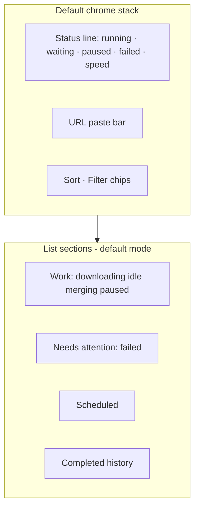
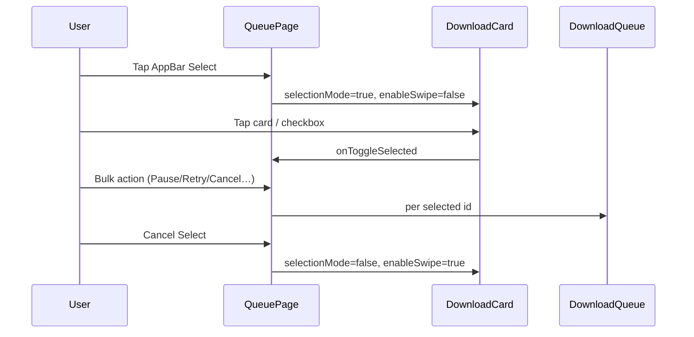
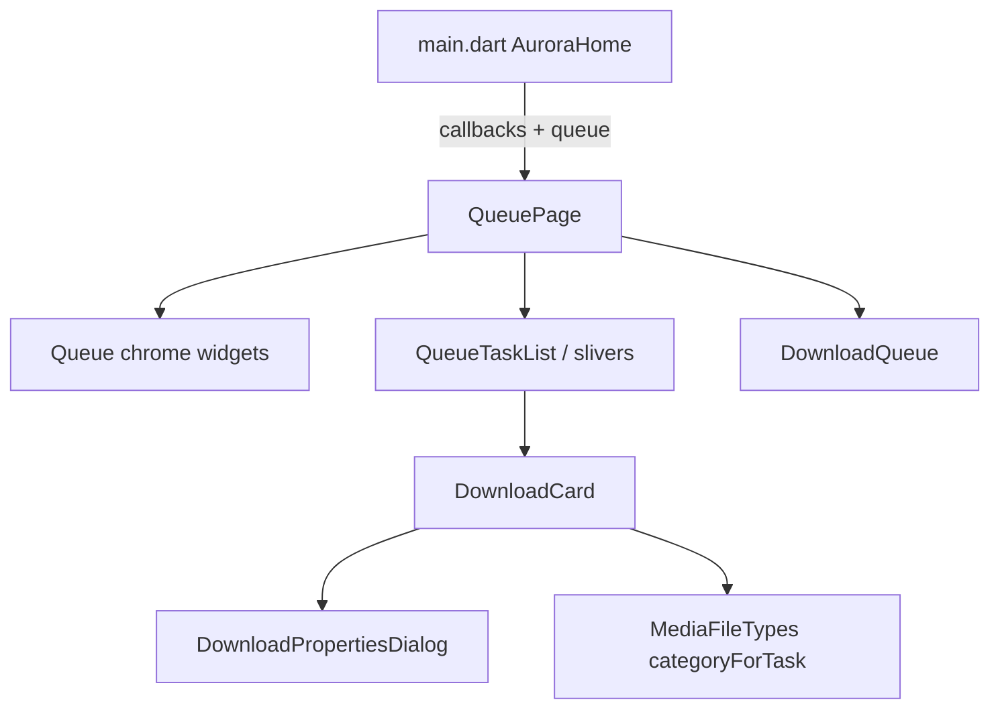
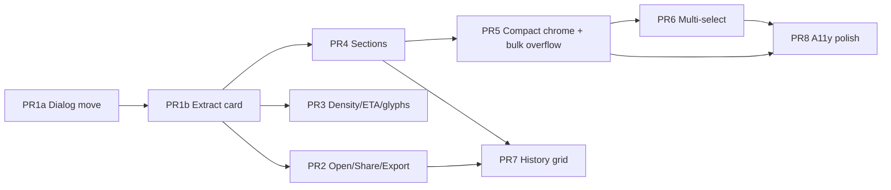

# Queue Screen UI Improvement Design

| Field | Value |
|-------|--------|
| **Document** | Aurora Downloader — Queue Screen UI/UX Improvement |
| **Author** | Design / Architecture (agent draft) |
| **Date** | 2026-07-16 |
| **Status** | Draft (rev 3 — product decisions locked) |
| **Scope** | Flutter Android Queue tab UI only |
| **Codebase** | `D:\02_Projects\Final_52191314_Server_and_Apps\aurora_downloader` |

---

## Overview

The Queue tab is Aurora’s primary download manager surface: users paste links, monitor active transfers, recover from failures (retry / refresh link / force merge), and open completed files. Functionally it is rich—search, sort, state filters, folder tabs, bulk pause/resume/retry, hold-to-swipe, resniff dialogs, undo-delete—but the **presentation has grown organically inside a single ~1.7k-line `queue_page.dart`**, with competing card implementations, underused callbacks, and phone density/accessibility issues.

This design proposes an **incremental UI/UX improvement** (not a download-engine rewrite): extract and unify list components, fix information hierarchy (work vs history), reclaim vertical space, surface dead actions (share/export) and list-primary Open, improve progress readability, and ship via ordered PRs that each **leave Queue usable**. Later PRs depend on earlier extracts (not every PR is fully independent).

---

## Background & Motivation

### Product placement

Aurora Home (`lib/main.dart`) uses tab preservation (visited-tab lazy build + opacity/IgnorePointer), not a classic `IndexedStack` at all times, but the product model is still **three main tabs**:

| Index | Screen | Role |
|------:|--------|------|
| 0 | `QueuePage` | Download list + paste-to-add |
| 1 | `SnifferScreen` | Browser + capture |
| 2 | `SettingsPage` | Preferences |

Bottom chrome: floating `AuroraDock` (`lib/ui/widgets/aurora_dock.dart`) with spring tab animation. Queue and Settings reserve bottom padding for the dock; Browser has its own bottom bar.

### Current implementation map

| Concern | Location |
|---------|----------|
| Queue shell, filters, bulk, cards, dialogs | `lib/ui/pages/queue_page.dart` (~1720 LOC) |
| Task row + properties dialog | `lib/ui/widgets/download_task_row.dart` — **`DownloadTaskRow` widget is dead** (not used by `QueuePage` list). **`DownloadPropertiesDialog` in the same file is live** (imported by `queue_page.dart`). Move dialog before deleting the file. |
| Empty state | `lib/ui/widgets/empty_queue.dart` |
| Swipe gesture | `lib/ui/widgets/edge_swipe_card.dart` (`HoldSwipeCard`, 400 ms arm) |
| Aggregate painter (legacy/mini) | `lib/ui/widgets/queue_progress_painter.dart` |
| Formatters | `lib/ui/widgets/settings_formatters.dart` (`formatSpeed`, `formatBytes`, `taskDisplayName`, `stateLabel`) |
| Media type maps | `lib/downloader/media_file_types.dart` (`MediaFileTypes`, `FileCategory`) |
| Panel chrome | `lib/ui/widgets/panel.dart` |
| Queue engine | `lib/downloader/download_queue.dart` (`queryTasks`, `activeTasks`, `queuedTasks`, pause/resume/cancel, history cap `maxCompletedTasks = 500`) |
| Task model | `lib/downloader/models.dart` (`DownloadState`, `DownloadTask`, `TaskSortField`, `statusMessage`, `failureReason`, `contentType`) |
| Theme tokens | `lib/theme/aurora_tokens.dart` (`AColors`), `aurora_palette.dart` (`context.ac`), `aurora_theme.dart` (Inter + JetBrainsMono) |
| Motion presets | `lib/ui/animations/aurora_spring.dart` |
| Snackbars | `lib/ui/notifications/aurora_snackbar.dart` |
| Pro gates (indirect) | `lib/premium/pro_features.dart` (`scheduledDownloads`, concurrency caps) |

### Current layout (list mode)

```text
┌─────────────────────────────────────────┐
│ AppBar: "Queue" · cloud_done · grid ico │
├─────────────────────────────────────────┤
│ Aggregate header (Active/Queued/Done/…) │
│ Paste URL bar                           │
│ Search bar                              │
│ Sort chip + state chips (All/Active/…)  │
│ Folder chips (if any)                   │
│ Bulk chips (Pause All / Retry All / …)  │
├─────────────────────────────────────────┤
│ Task card × N                           │
│  [status bar] name…  [primary] [⋮]      │
│  progress (2px) · metadata 8.5px mono   │
│  statusMessage / full failed error      │
└─────────────────────────────────────────┘
│              AuroraDock                 │
```

### Current task card interactions

| Input | Behavior |
|-------|----------|
| Primary icon | Pause / Resume / Retry / Cancel scheduled / merging spinner |
| Overflow ⋮ | Force merge, Refresh link, Scan in browser, View source page, Remove/Cancel, Properties |
| Hold 400 ms → swipe right | State-adaptive: pause / resume / retry / open / cancel scheduled |
| Hold 400 ms → swipe left | Delete with 5 s Undo snackbar (`_deleteTaskWithUndo`) |
| Grid toggle | **Completed-only** 2-col grid; empty message if no completed items |
| Completed Open | Available via **right-swipe** and **grid tap** only — **no list-row primary** |
| Share / Export | Callbacks on `QueuePage` + `main.dart` wiring — **never invoked** in Queue UI |

### States already modeled

`DownloadState`: `scheduled`, `idle`, `downloading`, `paused`, `completed`, `failed`, `merging`.

**Filter chips today** (`_stateFilterOptions`):

| Chip label | States |
|------------|--------|
| All | `null` (no filter) |
| Active | `{downloading, idle, merging}` — **excludes paused** |
| Scheduled | `{scheduled}` |
| Paused | `{paused}` |
| Done | `{completed}` |
| Failed | `{failed}` |

Sort fields: date, name, size, priority, state, speed (`TaskSortField` + `DownloadQueue.queryTasks`).

**Execution sets (engine, not filter chips):**

| API | Meaning |
|-----|---------|
| `queue.activeTasks` | Currently running downloads |
| `queue.queuedTasks` | Waiting for a concurrency slot |

### Freemium touchpoints (Queue UI)

Queue itself is **free-forever** for core pause/resume/list (tracker: “HTTP / HLS / basic queue”). Pro only affects:

- **Scheduled downloads** (`ProFeature.scheduledDownloads`) — UI already shows scheduled chips/metadata; gating lives at enqueue time / Settings, not in list chrome.
- **Concurrency display** — free max 3 concurrent (`ProFeatures.maxConcurrentFree`); aggregate counts are informational, not a gate UI.

**Do not introduce new Pro gates on Queue list polish.** Optional later: soft upsell on “Schedule” affordance only if product adds schedule-from-row. **Do not** put Drive/Pro status glyphs on the Queue AppBar (see Key Decisions).

### Pain points (grounded in code)

1. **God page** — `queue_page.dart` owns chrome, query, bulk ops, cards, swipe, properties, resniff duplicate, partial merge. Hard to iterate and test.
2. **Dual card implementations** — Live path is `_buildTaskRow` in `queue_page.dart`. `DownloadTaskRow` widget is dead; `DownloadPropertiesDialog` in the same file is live — dialog must move before file delete.
3. **Dead / incomplete actions** — `onShareDownload` and `onExportDownload` are declared on `QueuePage` and wired from `main.dart`, but **never invoked** in Queue UI. **Open is available via right-swipe and grid tap**, but the **list completed primary action is empty** (no one-tap Open on the list card).
4. **Decorative AppBar icon** — bare `Icons.cloud_done` with no `onPressed` / Drive binding. Binding Drive here would pull Pro/sync scope into Queue chrome — **prefer remove**, not half-bind.
5. **Chrome height tax** — On a mid phone, five stacked header blocks push the first work item below the fold when folder tabs + bulk chips appear.
6. **Flat list vs mental model** — Users think “what is running?” vs “what finished?”. Default date sort buries work under recent completed items unless the Active chip is selected.
7. **Grid mode is a trap** — AppBar toggle labeled list/grid, but grid **filters to completed only**, so switching while downloading looks broken (“No completed downloads yet”).
8. **Progress affordance weak** — Live list uses `LinearProgressIndicator` at **2 px** height; track is elevated surface with no explicit end-cap border. Paused tasks show **no** progress bar today.
9. **Metadata unreadable** — `fontSize: 8.5` JetBrainsMono for speed/size/elapsed fails practical mobile legibility.
10. **No media type cue** — Cards look identical for HLS video, audio, torrent, document; type infrastructure exists (`MediaFileTypes` / `FileCategory`) but is unused on Queue cards.
11. **No multi-select** — Bulk actions apply to **all filtered** tasks; no selective “pause these three.”
12. **RefreshIndicator no-op** — `onRefresh` only delays 300 ms.
13. **Duplicated naming logic** — `_taskDisplayName` / `_buildNameWidget` reimplemented beside shared `taskDisplayName`.
14. **ETA missing / would thrash if naïve** — Metadata shows elapsed for downloading, not remaining time; raw `speed` is bursty.
15. **Discoverability of hold-swipe** — Correct for scroll safety; no onboarding hint after first install.
16. **Gesture surface is the whole card** — `HoldSwipeCard` arms on 400 ms hold across the card body; any “long-press to multi-select” would fight this (see Multi-select gesture policy).

---

## Goals & Non-Goals

### Goals

1. Make **work items (running / waiting / paused)** scannable in under one second on a phone.
2. Align Queue visuals with **Aurora Nordic glass** language (`context.ac`, frost accent, hairline borders, Inter + mono data).
3. Unify on **one card component** with a **documented constructor/callback API**, including list-primary Open and Share/Export for completed tasks.
4. Improve **information architecture**: work vs needs-attention vs history, without deleting history.
5. Reclaim **vertical space** via compact chrome while keeping paste-to-add first-class.
6. Raise **accessibility**: min type sizes, ≥40 dp targets, semantics, reduced-motion APIs.
7. Ship **incrementally** — each PR leaves Queue usable; dependencies are explicit (not a fiction of full independence).

### Non-Goals

| Non-goal | Rationale |
|----------|-----------|
| Rewrite `DownloadQueue` / splitter / HLS engine | UI-only initiative |
| Change sniffer capture or add-to-queue dialogs | Separate surfaces (priority dropdown at add remains) |
| New download protocols or cloud backend | Out of scope |
| Full desktop / tablet adaptive redesign | Phone-first |
| New Pro monetization of queue features | Free-forever baseline |
| Drive sync status on Queue AppBar | Avoid Pro/sync chrome creep; Settings owns Drive |
| Replace `HoldSwipeCard` with always-on swipe | Would fight vertical scroll |
| Thumbnail generation / video frame extract | Costly; type glyphs first |
| Infinite history beyond `maxCompletedTasks` | Engine cap 500 remains |
| Long-press-to-enter multi-select (v1) | Conflicts with hold-swipe arm |

---

## Proposed Design

### Design principles (Aurora-specific)

1. **Nordic glass, not Material defaults** — Cards use `surfaceCard` + `glassBorder` hairlines; accents `accentFrost` (running), `accentAmber` (paused), `statusSuccess` / `statusError`, `accentPurple` (scheduled).
2. **Data is mono, labels are Inter** — Speeds, bytes, ETA in JetBrainsMono; titles Inter medium/semibold.
3. **One primary action per state** — Visible icon; everything else in ⋮ or multi-select.
4. **History is quiet; work is loud** — Work cards denser/brighter; completed rows quieter.
5. **Signature motion** — `AuroraSpring` presets; no decorative mesh.

### Information architecture

#### Canonical vocabulary (single source of truth)

Do **not** overload the word “Active.” Three related concepts:

| Term | Definition | UI home |
|------|------------|---------|
| **Running** | Tasks in `queue.activeTasks` (currently downloading/executing) | Status strip segment “running” |
| **Waiting** | Tasks in `queue.queuedTasks` (idle in execution queue, awaiting slot) | Status strip segment “waiting” |
| **Paused** | `state == paused` | Status strip + **Paused** filter chip |
| **Filter “Active”** | Existing chip: `{downloading, idle, merging}` — **unchanged; still excludes paused** | Filter bar |
| **Section “Work”** | List section grouping **work-in-flight + paused**: `{downloading, idle, merging, paused}` | Sectioned list (renamed from “Active” to avoid chip collision) |



#### Section rules

| Section | States | Default expand | Within-section default order |
|---------|--------|----------------|------------------------------|
| **Work** | `downloading`, `idle`, `merging`, `paused` | Always expanded | Sub-order: downloading → merging → paused → idle; then apply user sort field |
| **Needs attention** | `failed` | Expanded if count > 0 | Newest failure first when sort is default date; else user sort within section |
| **Scheduled** | `scheduled` | Expanded if count > 0 | `scheduledStartAt` ascending |
| **Completed** | `completed` | **Collapsed** when Work non-empty **and** completed count **> 8**; else expanded | User sort (default date descending = newest first) |

When user selects a **state filter chip**, show only matching states (still use section headers if multiple sections would be non-empty; single-section when chip is pure).

Folder filter remains a post-filter on `queryTasks` results.

#### Section × sort interaction (Key Decision)

1. **Sections always partition first** (when “Flat list” is off — default).
2. **Sort applies within each section only** — never reorders a completed item above a downloading item while sections are on.
3. Sort sheet includes **“Flat list (no sections)”** toggle (off by default). When on: single list, global sort as today via `queryTasks`.
4. Default sort remains `TaskSortField.date` descending **within** each section (Completed: newest first; Work sub-order above still applied first for Work section).

### App chrome redesign

#### AppBar

| Current | Proposed |
|---------|----------|
| Title “Queue” + decorative `cloud_done` + list/grid | Title “Queue” + optional subtitle badge (`2 running`) + **search** icon (expands search) + **Select** icon (multi-select) + overflow (**History grid** only — **no Clear completed**) |

**PR2 removes** the decorative `cloud_done` icon entirely. Drive status stays in Settings; no half-bound glyph on Queue.

**Clear completed** is **out of scope for this design** — do not add to AppBar, overflow, or multi-select bulk menus.

#### Aggregate header → single status line

Replace the multi-badge panel with a **one-line status strip** that **preserves running vs waiting**:

```text
● 2 running  ·  3 waiting  ·  1 paused  ·  ! 1 failed  ·  ▸ 4.2 MB/s  ·  limit 500 KB/s
```

| Segment | Source | Tap action |
|---------|--------|------------|
| running | `queue.activeTasks.length` (**always unfiltered** whole-queue total) | Set filter chip **Active** (`{downloading, idle, merging}`) |
| waiting | `queue.queuedTasks.length` (**always unfiltered**) | Set filter chip **Active** |
| paused | count `state == paused` (**always unfiltered**) | Set filter chip **Paused** |
| failed | count `state == failed` (**always unfiltered**; error tint when > 0) | Set filter chip **Failed** |
| speed | sum of speeds on downloading tasks (whole queue) | none |
| limit | `speedLimitKbps` when > 0 | none |

**Status strip never respects folder chips, state filter chips, or search.** Folder chips / filters only narrow the list body. Strip always answers “what is going on in the whole queue?”

Omit zero-count segments except when all work is idle (still show `0 running · N waiting` if waiting > 0). When queue empty: hide strip; empty state owns the message.

#### Default chrome stack (success metric inventory)

**Default case** (no search expanded, no folders, not multi-select):

| Row | Content |
|-----|---------|
| 1 | Status line (hidden if empty queue) |
| 2 | Paste URL bar |
| 3 | Sort chip + state filter chips |

**Conditional fourth row:** folder chips when any task has a folder.

**Not in default stack:** always-visible bulk chips (moved to overflow in PR5, or multi-select in PR6); expanded search (AppBar-triggered).

Success metric “≤ 3 chrome rows” = rows 1–3 above when status line visible and no folders. Folder chips are an accepted fourth conditional row.

#### Paste + search

- Paste bar always visible (primary manual-add job).
- Search collapsed into AppBar expand; auto-expand when `_searchQuery` non-empty.

#### Filters row

Keep horizontal chips; reduce unselected weight. Show **count badges** on chips from **unfiltered whole-queue** totals (same source policy as the status strip).

Filter chip definitions **remain as today** (Active excludes paused). Section “Work” is a **list grouping name only**, not a rename of the Active chip.

#### Bulk actions — complete matrix

Today’s bulk row (`_buildBulkActions`): Pause All, Resume All, Retry All, Cancel Scheduled, Cancel Active (confirm + temp wipe).

| Action | Scope | Confirm? | AppBar overflow (PR5) | Multi-select (PR6) |
|--------|-------|----------|----------------------|--------------------|
| Pause all active | filtered: `downloading` \| `idle` | No | Yes | Pause selected (if any selected are running/idle) |
| Resume all paused | filtered: `paused` | No | Yes | Resume selected |
| Retry all failed | filtered: `failed` | No | Yes | Retry selected |
| Cancel scheduled | filtered: `scheduled` | Optional light confirm | Yes | Cancel selected scheduled |
| Cancel active (non-completed, non-scheduled) | filtered: same as today | **Yes** — existing copy: temps deleted | Yes | Delete/cancel selected with same confirm rules |

**PR5 dependency rule:** bulk chips may be removed **only in the same PR** that adds the full overflow matrix above (all five actions). Prefer **PR5 after PR6** *or* implement overflow fully in PR5 so there is **no power-regression window**. See revised PR plan.

#### Pull-to-refresh

**Remove** no-op `RefreshIndicator`. Explicit Retry All remains for recovery.

### Component: `DownloadCard` (unified)

New primary widget: `lib/ui/widgets/download_card.dart` (replaces live `_buildTaskRow`; `DownloadTaskRow` deleted only after dialog move).

#### Constructor / callback API (implementable)

```dart
/// Single queue list/grid card. Owns presentation, HoldSwipeCard (when enabled),
/// primary button, and overflow menu construction. Parent owns engine calls
/// and destructive undo orchestration via callbacks.
class DownloadCard extends StatelessWidget {
  const DownloadCard({
    super.key,
    required this.task,
    required this.onOpenDownload,
    this.onPause,
    this.onResume,
    this.onRetry,
    this.onCancel,           // parent may wrap with confirm or undo-delete
    this.onForceMerge,
    this.onResniffAuto,
    this.onResniffManual,
    this.onOpenUrlInBrowser,
    this.onShare,
    this.onExport,
    this.onShowProperties,   // default: show DownloadPropertiesDialog if null
    /// When true, swipe is disabled; leading checkbox shown; body tap toggles selection.
    this.selectionMode = false,
    this.selected = false,
    this.onToggleSelected,
    /// When false, card is plain (e.g. grid tile content without swipe).
    this.enableSwipe = true,
    this.dense = false,
  });

  final DownloadTask task;

  final Future<void> Function(DownloadTask task) onOpenDownload;
  final VoidCallback? onPause;
  final VoidCallback? onResume;
  final VoidCallback? onRetry;
  final VoidCallback? onCancel;
  final VoidCallback? onForceMerge;
  final Future<void> Function(DownloadTask task)? onResniffAuto;
  final Future<void> Function(DownloadTask task)? onResniffManual;
  final void Function(String url)? onOpenUrlInBrowser;
  final Future<void> Function(DownloadTask task)? onShare;
  final Future<void> Function(DownloadTask task)? onExport;
  final VoidCallback? onShowProperties;

  final bool selectionMode;
  final bool selected;
  final VoidCallback? onToggleSelected;

  final bool enableSwipe;
  final bool dense;
}
```

**Ownership split**

| Concern | Owner |
|---------|--------|
| Visual layout, progress, meta, glyphs | `DownloadCard` |
| `HoldSwipeCard` wrap | **Internal** to `DownloadCard` when `enableSwipe && !selectionMode` |
| Overflow menu item list | **Built inside** `DownloadCard` from non-null callbacks + `task.state` |
| Confirm dialogs for cancel from ⋮ | Card may show lightweight confirm **or** parent passes `onCancel` that already confirms — **v1: parent `_deleteTaskWithUndo` / confirm for non-swipe cancel matches today**; swipe left still calls parent undo-delete |
| Resniff duplicate / partial merge dialogs | **Always `QueuePage`** (not card) |
| Selection set | `QueuePage` state; card only reports toggles |

**QueuePage wiring sketch**

```dart
DownloadCard(
  task: task,
  onOpenDownload: widget.onOpenDownload,
  onPause: widget.onPauseTask?.call(task),
  onResume: widget.onResumeTask?.call(task),
  onRetry: widget.onRetryTask == null ? null : () => widget.onRetryTask!(task),
  onCancel: () => unawaited(_deleteTaskWithUndo(task)),
  onForceMerge: widget.onForceMergeTask == null ? null : () => unawaited(widget.onForceMergeTask!(task)),
  onResniffAuto: widget.onResniffAuto,
  onResniffManual: widget.onResniffManual,
  onOpenUrlInBrowser: widget.onOpenUrlInBrowser,
  onShare: widget.onShareDownload,
  onExport: widget.onExportDownload,
  selectionMode: _selectionMode,
  selected: _selectedIds.contains(task.id),
  onToggleSelected: () => _toggle(task.id),
  enableSwipe: !_selectionMode && !_viewMode,
);
```

#### Layout (list density — phone)

```text
┌──────────────────────────────────────────────────────┐
│▌ [glyph]  Title…ext.mp4     [prio]   [▶/Ⅱ/↻/↗] [⋮]  │
│          12.3 / 45.6 MB · 1.2 MB/s · ~5m            │
│          ████████████░░░░░░░░  27%                   │
│          Converting .ts to .mp4…                     │
│          Couldn't download. CDN blocked…             │
└──────────────────────────────────────────────────────┘
```

#### Type / state glyph mapping

**Strip color** = state (table below). **Glyph** = media **type** (preferred), with state-only icon when type is unknown.

Pure helper (prefer reuse, no parallel map):

```dart
/// Uses MediaFileTypes / FileCategory — do not invent a second taxonomy.
FileCategory categoryForTask(DownloadTask task) {
  // 1) magnet: → torrent / archive category as MediaFileTypes defines
  // 2) contentType MIME → MediaFileTypes.categoryForMime / equivalent
  // 3) extension from taskDisplayName(task) → MediaFileTypes.categoryForExtension
  // 4) URL path (.m3u8 / .mpd) → video/playlist → FileCategory.video (or existing)
  // 5) fallback → FileCategory.other (or equivalent)
}

IconData iconForCategory(FileCategory c) { /* fixed table */ }
```

| `FileCategory` (or equivalent) | Icon (Material) |
|--------------------------------|-----------------|
| video / HLS-like | `Icons.movie_outlined` |
| audio | `Icons.audiotrack` |
| image | `Icons.image_outlined` |
| document | `Icons.description_outlined` |
| archive | `Icons.folder_zip_outlined` |
| torrent | `Icons.share` / torrent-appropriate |
| subtitle | `Icons.subtitles_outlined` |
| other / unknown | fall back to **state** icon: download / pause / error / check / schedule |

State tints the **3 px strip** and primary action color; glyph stays type-forward when known.

#### Visual rules by state

| State | Strip color | Progress | Primary action |
|-------|-------------|----------|----------------|
| downloading / idle | `accentFrost` | Determinate if `totalBytes > 0` else indeterminate; **minHeight 6**, track `surfaceElevated` + **0.5 px `borderStrong`**, fill frost | Pause |
| paused | `accentAmber` | **Frozen fill** (same value as last known progress) — **new vs today** (today: no bar); ship in **PR3**, not PR1 | Resume |
| merging | `accentAmber` | Indeterminate or statusMessage | Spinner (no button) |
| scheduled | `accentPurple` | none | Cancel schedule |
| failed | `statusError` | optional partial fill if bytes known | **Smart primary** (see below) |
| completed | `statusSuccess` | none | **Open** (`onOpenDownload`) |

#### Failed primary action matrix (v1 default)

| Condition | Primary | Overflow still has |
|-----------|---------|-------------------|
| `failureReason` ∈ {`urlExpired`, `httpForbidden`, `httpUnauthorized`, `hlsTokenExpired`, `hlsCircuitBreaker`} **and** `onResniffAuto != null` | **Refresh link** | Retry |
| else | **Retry** | Refresh link if available |

#### Typography scale (Queue card)

| Role | Font | Size | Weight | Color |
|------|------|------|--------|-------|
| Title | Inter | 13 | w600 | textPrimary |
| Extension tail | Inter | 13 | w600 | textSecondary |
| Meta | JetBrainsMono | **11** (min) | w400 | textTertiary |
| statusMessage | Inter | 11 | w500 | accentFrost |
| Error body | Inter | 12 | w400 | statusError · height 1.35 |
| Percent | JetBrainsMono | 10 | w500 | textSecondary |
| Priority pill | Inter | 10 | w600 | textSecondary / accent when high |

#### Metadata composition

1. Bytes via `formatBytesPair` when totals known; else downloaded-only.
2. `formatSpeed` when downloading.
3. **ETA** via `formatEta` (smoothed — below) when `totalBytes > 0` and stable speed.
4. Paused: bytes + “Paused” + frozen bar (PR3).
5. Failed: bytes saved + short label; full error below (strip `[PARTIAL:…]`).
6. Scheduled: relative start (existing logic).

**Do not invent segment counts** until `DownloadTask` exposes them.

#### ETA smoothing (PR3)

```dart
// Show ETA only when:
// - totalBytes > 0
// - speedBytesPerSec > minThreshold (e.g. 8 KB/s) continuously for ≥ 2 s
// - use EMA: speedEma = alpha * speed + (1 - alpha) * speedEma (alpha ≈ 0.2)
// Format coarse buckets: "~30s", "~2m", "~5m", "~15m", "~1h", "~2h" — avoid second-level thrash
String? formatEta({ required int downloadedBytes, required int totalBytes, required double speedEma });
```

Card or parent may keep a small `Map<taskId, _EtaState>` for EMA; pure `formatEta` stays formatter-side.

#### Actions menu (overflow) — complete set

| Item | When |
|------|------|
| Open | completed + `onOpenDownload` |
| Share | completed + `onShare != null` |
| Export / Save as | completed + `onExport != null` |
| Refresh link | non-magnet/blob + `onResniffAuto` |
| Scan in browser | `onResniffManual` |
| View source page | `sourcePageUrl` + `onOpenUrlInBrowser` |
| Force merge | non-active failed/paused as today + `onForceMerge` |
| Set priority | **Deferred** (overflow later); v1 shows indicator only |
| Properties | always |
| Remove / Cancel | always (not merging) |

**Change URL** is **out of v1 Queue polish** — Refresh link / resniff covers expired CDN cases. Do not add a Change URL overflow item in this design.

#### Priority indicator (closes open question)

- Priority is settable at add-queue (`add_queue_dialog.dart`) and used by scheduler/preemption.
- **v1:** when `task.priority != DownloadPriority.medium`, show a small trailing pill (`High` / `Low`) on the card. Sort-by-priority remains useful and no longer fully opaque.
- **Not v1:** edit priority from Queue overflow (optional later).

#### Swipe semantics + multi-select gesture policy

**Keep `HoldSwipeCard`** outside selection mode:

- Right swipe → adaptive primary (pause / resume / retry-or-refresh / open).
- Left swipe → delete + Undo.

**Multi-select entry (v1) — Key Decision:**

| Path | v1 |
|------|-----|
| AppBar **Select** | **Yes — primary and only entry** |
| Long-press card to enter selection | **No** — conflicts with 400 ms hold-swipe arm on the same surface |
| Leading checkbox | Shown **only after** Select mode is on; tap checkbox or body toggles |
| Hold-swipe while `selectionMode` | **Disabled** (`enableSwipe: false`) |
| Exit selection | AppBar Cancel / back |



Improve swipe backgrounds: short label under icon; reduced-motion snap via `AuroraSpring.cardSnap` (PR8).

### Empty & filter-empty states

| Condition | UI |
|-----------|-----|
| No tasks | `EmptyQueue` + “Paste a link above…” + secondary **Open Browser** CTA when `onOpenBrowser != null` |
| Filter/search empty | search_off + Reset filters |
| History grid empty | “No finished downloads yet. Completed files will appear here.” |

**Open Browser CTA (locked):** `QueuePage` accepts optional `onOpenBrowser`; `main.dart` wires `() => _selectTab(1)`. Empty queue shows a secondary button (e.g. “Open Browser”) that switches to the Browser tab. Not shown when the callback is null (tests).

Pulse icon: skip when `MediaQuery.disableAnimationsOf(context)` is true.

### History / grid mode

- **List (default):** sectioned queue (or flat if toggle on).
- **History grid:** completed-only tiles; tap = open; **no long-press multi-select entry** (use AppBar Select, same as list). Tooltip: “Completed history grid”.

### Motion & feedback

| Event | Motion |
|-------|--------|
| Card insert | Fade + 8 px slide, 200 ms (skip if animations disabled) |
| Progress updates | Keep 500 ms rebuild throttle |
| Swipe arm | Haptic + scale **unless** animations disabled |
| Section expand/collapse | `AnimatedSize` 200 ms (skip if disabled) |

### Accessibility & density

| Topic | Spec |
|-------|------|
| Min interactive | Primary/overflow ≥ **40×40** logical (pad hit target; icon 18–20) |
| Semantics | `Semantics(label: '$name, ${stateLabel(state)}, $percent')` |
| Contrast | `AColors` tokens |
| Text scale | Use `MediaQuery.textScalerOf(context)` (not deprecated `textScaleFactor`); layout grows at 1.3× |
| Reduced motion | `MediaQuery.disableAnimationsOf(context)` (or `MediaQuery.of(context).disableAnimations`). When true: no empty-state pulse, no card insert slide, no swipe arm scale; snap uses short/non-overshoot path |
| HoldSwipeCard | PR8: route snap through `AuroraSpring.cardSnap`; currently hardcodes equivalent springs without calling `AuroraSpring` |

### Architecture after extraction



| File | Responsibility |
|------|----------------|
| `lib/ui/pages/queue_page.dart` | State, subscriptions, query, section partition, selection set, dialogs (resniff/partial), bulk orchestration |
| `lib/ui/widgets/download_card.dart` | Card API above + internal HoldSwipe |
| `lib/ui/widgets/download_properties_dialog.dart` | Moved from `download_task_row.dart` |
| `lib/ui/widgets/queue_status_line.dart` | Aggregate strip |
| `lib/ui/widgets/queue_filter_bar.dart` | Sort + state chips + flat-list toggle entry |
| `lib/ui/widgets/queue_url_bar.dart` | Paste field |
| `lib/ui/widgets/empty_queue.dart` | Keep / extend |
| `lib/ui/widgets/settings_formatters.dart` | Formatters + `formatEta` |
| `lib/downloader/media_file_types.dart` | `categoryForTask` helper (or thin UI wrapper calling it) |
| Delete after move | `DownloadTaskRow` class / file once dialog relocated |

---

## API / Interface Changes

### `QueuePage` constructor (additive)

```dart
class QueuePage extends StatefulWidget {
  // existing fields including:
  final Future<void> Function(DownloadTask task) onShareDownload;
  final Future<void> Function(DownloadTask task)? onExportDownload;
  /// Empty-state “Open Browser” CTA → Browser main tab. Wired from main.dart.
  final VoidCallback? onOpenBrowser;
}
```

Wire: `onOpenBrowser: () => _selectTab(1)` in `AuroraHome` when building `QueuePage`.

### New pure helpers

```dart
String? formatEta({
  required int downloadedBytes,
  required int totalBytes,
  required double speedEmaBytesPerSec,
});

FileCategory categoryForTask(DownloadTask task); // prefers MediaFileTypes

Widget buildTaskName(DownloadTask task, TextStyle style, {bool centered = false});
```

### No engine / schema changes for v1

`DownloadQueue.queryTasks`, JSON persistence, and `DownloadTask` fields remain as today.

**Layout UI state is session-only (locked):** section expand/collapse, flat-list toggle, selection mode, and search text are **not** written to `DownloadSettings` or disk. Every cold start: **sections on** (flat list off); **Completed collapsed** when Work non-empty and completed count > 8; filters/sort default as today.

### Optional later

- `completedSegments` / `totalSegments` on `DownloadTask` for HLS meta.
- Set priority from Queue overflow.
- Change URL from Queue (explicitly not in this design).

---

## Data Model Changes

**None for UI v1.**

History retention: `maxCompletedTasks = 500`. Clear-completed (if added later) reuses cancel/remove paths and must not resurrect temps for completed public files.

---

## Alternatives Considered

### A. Big-bang rewrite of Queue as separate package

- **Pros:** Clean architecture.
- **Cons:** Long branch; high regression risk on resniff/undo/partial merge.
- **Decision:** Reject; incremental extract.

### B. Keep flat list; only restyle cards

- **Pros:** Smallest diff.
- **Cons:** Does not fix work-vs-history scanning.
- **Decision:** Restyle is PR3; sections remain in PR4 for Goal 1.

### C. Always-on swipe without hold (Dismissible)

- **Pros:** Familiar.
- **Cons:** Scroll conflict; already solved by `HoldSwipeCard`.
- **Decision:** Keep hold-to-arm.

### D. Tabs inside Queue (Active \| History)

- **Pros:** Clear IA.
- **Cons:** Nested tabs under main Queue; fights filter chips.
- **Decision:** Prefer sections + optional History grid.

### E. Material `ListTile` / `ExpansionTile` defaults

- **Pros:** Fast.
- **Cons:** Breaks Aurora glass language.
- **Decision:** Custom `DownloadCard`.

### F. Flat list + sticky “Active now” pin (1–3 running) above history

- **Pros:** Cheaper than full sectioning + collapse heuristics; answers “what’s running?” with a small always-visible strip of running cards.
- **Cons:** Waiting/paused/failed still bury under history; pin capacity arbitrary; two layout modes (pin + list) without solving filter×sort; still needs completed collapse or history noise. Does not replace Needs attention / Scheduled structure.
- **Decision:** **Reject as primary IA.** Sections (PR4) give a complete model. A pin could be a future **additive** shortcut on top of sections, not a substitute.

---

## Security & Privacy Considerations

| Topic | Notes |
|-------|-------|
| URLs in Properties | Selectable; avoid logging full signed URLs in new breadcrumbs |
| Share sheet | Existing `_shareDownload` |
| Undo restore | Reattach bridges via `_TaskCallbacks` |
| Multi-delete / Cancel active | Confirm when selection includes non-completed (temp wipe) |
| Drive icon | Not on Queue AppBar (no accidental Pro upsell surface) |

No new permissions.

---

## Observability

| Signal | How |
|--------|-----|
| Rebuild pressure | Keep 500 ms coalescing |
| Actions | Optional `AuroraLog` screen `queue`: `queue_card_open`, `queue_share`, `queue_multiselect_delete` |
| Regressions | Per-PR smoke checklist (below) |

---

## Risks

| Risk | Severity | Mitigation |
|------|----------|------------|
| Resniff / partial merge / undo regressions | High | Dialogs stay on `QueuePage`; PR1a/1b behavior-preserving; smoke checklist |
| Touch targets increase height | Medium | 40 dp hit boxes via padding |
| Sectioning vs sort-by-name | Medium | Flat-list toggle in sort sheet |
| Grid rename | Low | Tooltip “Completed history grid” |
| Deleting `download_task_row.dart` too early | Medium | Move `DownloadPropertiesDialog` first (PR1a) |
| LOC after PR5 still high (dialogs) | Low | Success criterion adjusted — dialogs may remain on page |
| Power regression if bulk chips removed early | High | Full overflow matrix in same PR as chip removal |
| Gesture fight multi-select vs swipe | High | **No long-press enter**; swipe off in selection mode |

---

## Rollout Plan

1. No feature flag for behavior-preserving extracts.
2. Each PR: debug APK (`adb install -r`) + **mandatory smoke checklist** (below).
3. Rollback: single-PR revert; no engine coupling.
4. Update `docs/code-maps/projects/aurora_downloader.md` when files move.
5. Session log per `Agents.md`.

### Mandatory smoke checklist (every PR that touches Queue)

- [ ] Paste URL add (or mock task present)
- [ ] Pause / resume downloading task
- [ ] Retry failed task
- [ ] Swipe left → undo delete (when swipe enabled)
- [ ] Swipe right adaptive action
- [ ] Overflow: Refresh link / Scan in browser if available
- [ ] Partial merge dialog path if `[PARTIAL:]` can be simulated
- [ ] Resniff duplicate dialog path if available
- [ ] Open completed (list primary after PR2; swipe always)
- [ ] Share/Export after PR2
- [ ] Multi-select after PR6: select via AppBar only; swipe disabled

---

## Open Questions

All product questions for this design are **resolved**. Implementers should not re-open these without a new product request.

1. ~~Collapse threshold N=8~~ → **Resolved:** N=8 when Work non-empty; non-persisted.
2. ~~Persist section expand / flat-list preference~~ → **Resolved:** **Do not persist.** Forget each launch. Always start with sections on; Completed collapsed when Work non-empty and completed count > 8. **No new `DownloadSettings` fields** for layout.
3. ~~Change URL menu item~~ → **Resolved:** **Defer / out of v1.** Refresh link / resniff covers expired CDN cases.
4. ~~Empty-state Open Browser CTA~~ → **Resolved:** **Yes.** Optional `onOpenBrowser` from `main.dart`; empty queue shows Open Browser CTA.
5. ~~failureReason primary~~ → **Resolved:** smart primary matrix (Refresh link vs Retry).
6. ~~Priority opacity~~ → **Resolved:** indicator when ≠ medium; no edit-from-queue in v1.
7. ~~Clear completed~~ → **Resolved:** **No.** Do not add Clear completed to AppBar, overflow, or this design’s bulk menus.
8. ~~Status strip counts~~ → **Resolved:** Always **unfiltered whole-queue** totals. Folder chips (and other filters) only filter the list, not the strip.

---

## Key Decisions

| Decision | Rationale |
|----------|-----------|
| **UI-only, incremental PRs with explicit deps** | Engine stable; risk in resniff/undo; not every PR is fully independent |
| **One `DownloadCard` with documented constructor** | Ends dual implementations; implementable API |
| **Section “Work” ≠ filter “Active”** | Active chip stays `{downloading, idle, merging}`; Work section also includes `paused` |
| **Status strip keeps running · waiting · paused** | Maps to `activeTasks` / `queuedTasks` / paused count; free concurrency max 3 makes waiting real |
| **Status strip counts always unfiltered** | Whole-queue totals only; folder chips / state filters / search do not change the strip |
| **Sections partition first; sort within section; flat-list toggle** | Goal 1 without stranding power users |
| **Layout prefs not persisted** | Each launch: sections on; Completed collapse N=8 when Work non-empty; no `DownloadSettings` layout fields |
| **Completed collapse N=8 when Work non-empty** | Locked product default, session-only memory |
| **Non-sticky section headers in v1** | Simple multi-sliver / header rows; sticky deferred |
| **Multi-select: AppBar Select only; no long-press enter** | Avoids HoldSwipeCard 400 ms conflict |
| **Hold-swipe disabled in selection mode** | Clean gesture resolution |
| **Keep HoldSwipeCard outside selection** | Scroll safety |
| **Surface Share/Export; list-primary Open for completed** | Share/Export unwired; Open missing as list primary (swipe/grid remain) |
| **Remove decorative `cloud_done`; no Drive bind on Queue** | Avoid Pro/sync chrome creep |
| **Bulk: full 5-action matrix in overflow before chip removal** | No power regression vs today’s chips |
| **No Clear completed in this design** | Product decision — not AppBar, not overflow, not multi-select bulk |
| **No Change URL in v1 Queue polish** | Refresh link / resniff covers expired CDN; defer Change URL |
| **Empty-state Open Browser CTA** | `onOpenBrowser` → `_selectTab(1)`; secondary button on empty queue |
| **Type glyph via `MediaFileTypes` / `FileCategory`** | Reuse; strip = state |
| **Failed smart primary: Refresh link for expired/auth/forbidden when available** | CDN token pain |
| **Priority: indicator when ≠ medium; sort kept** | Sort useful; card was opaque |
| **ETA: EMA + coarse buckets + 2 s stability** | Avoid 500 ms flicker |
| **Paused frozen progress in PR3 only** | Explicit non-preserving visual change |
| **PR1 split: 1a dialog move; 1b card extract** | Realistic review size |
| **No new Pro gates on Queue polish** | Freemium free-forever queue |
| **Defer segment counts until model fields exist** | Avoid fake UI |
| **Reject pin-only Alternative F as primary IA** | Sections more complete |
| **Default chrome ≤ 3 rows (+ conditional folders)** | Concrete inventory for success metric |
| **Reduced motion: `MediaQuery.disableAnimationsOf` + `AuroraSpring.cardSnap`** | Precise APIs |
| **Voice guide path: monorepo `../docs/aurora_copy_voice.md`** | Not under app `docs/` |

---

## References

- `Agents.md` — build/install, architecture, freemium rules
- `docs/code-maps/projects/aurora_downloader.md` — project map
- `docs/premium_implementation_tracker.md` / `docs/premium_freemium_strategy.md`
- **Voice / copy:** `D:\02_Projects\Final_52191314_Server_and_Apps\docs\aurora_copy_voice.md` (from app tree: `../docs/aurora_copy_voice.md`)
- `docs/sessions/SESSION_2026-07-11_10-XX.md` — card compaction / progress bar intent
- `docs/sessions/SESSION_2026-07-10_14-14.md` — queue URL field / Change URL
- `docs/sessions/SESSION_2026-07-15_08-36.md` — voice rewrite for Queue copy
- `lib/ui/pages/queue_page.dart`, `download_task_row.dart`, `empty_queue.dart`, `edge_swipe_card.dart`
- `lib/downloader/download_queue.dart`, `models.dart`, `media_file_types.dart`
- `lib/theme/aurora_tokens.dart`, `aurora_theme.dart`
- `.agents/skills/frontend-design/SKILL.md`

---

## PR Plan

**Delivery model:** Each PR must leave Queue usable and pass the smoke checklist. Some PRs **depend on prior ones**; “independently mergeable” means “no half-broken intermediate,” not “order-free.”

### PR1a — Move `DownloadPropertiesDialog`; clarify dead row

- **Title:** `Queue: relocate DownloadPropertiesDialog; deprecate DownloadTaskRow`
- **Files:** New `lib/ui/widgets/download_properties_dialog.dart`; update imports in `queue_page.dart`; remove or empty `DownloadTaskRow` class; keep file only if needed until 1b
- **Dependencies:** None
- **Description:** Behavior-preserving dialog move. Document that `DownloadTaskRow` widget is dead; dialog was live. Do not delete dialog with the row.

### PR1b — Extract `DownloadCard` (behavior-preserving)

- **Title:** `Queue: extract DownloadCard from queue_page`
- **Files:** New `lib/ui/widgets/download_card.dart` with **full constructor API** above; wire from `queue_page.dart`; shared `taskDisplayName` where possible; delete dead `DownloadTaskRow` if remaining
- **Dependencies:** PR1a
- **Description:** Lift `_buildTaskRow` + swipe + primary/overflow **as they behave today** (no list-primary Open yet if that would change behavior — Open via swipe remains; completed primary may stay empty until PR2). No frozen paused bar yet (PR3). No multi-select flags required yet (defaults false).

### PR2 — Surface completed actions (Open / Share / Export); remove cloud_done

- **Title:** `Queue: list-primary Open; wire Share/Export; remove decorative cloud icon`
- **Files:** `download_card.dart`, `queue_page.dart`, AppBar in `queue_page.dart`
- **Dependencies:** PR1b
- **Description:** Completed list primary = Open. Overflow Share/Export using existing callbacks. **Remove** decorative `cloud_done` (no Drive bind). Wording: Share/Export were unwired; Open was missing as **list primary** (swipe/grid already open).

### PR3 — Density, progress bar, typography, ETA, paused freeze, type glyphs

- **Title:** `Queue: readable progress, type glyphs, ETA smoothing, touch targets`
- **Files:** `download_card.dart`, `settings_formatters.dart` (`formatEta`), `media_file_types.dart` or thin helper (`categoryForTask`), touch targets ≥ 40 dp
- **Dependencies:** PR1b
- **Description:** Progress minHeight 6 + track border; meta ≥ 11; title 13; **paused frozen progress (explicit change)**; EMA ETA + coarse buckets; type glyphs via `FileCategory`; failed smart primary matrix; priority pill when ≠ medium. Keep 500 ms throttle.

### PR4 — Sectioned list + sort-within-section + flat-list toggle

- **Title:** `Queue: Work/Needs attention/Scheduled/Completed sections`
- **Files:** `queue_page.dart` task slivers; optional `queue_section_header.dart`
- **Dependencies:** PR1b
- **Description:** Partition after filters. **Non-sticky** section headers (v1). Collapse Completed when Work non-empty and completed count > **8**. Sort within section; Sort sheet **“Flat list (no sections)”** toggle (**session-only** — always sections-on on cold start; not persisted). Vocabulary: section **Work** (includes paused); filter Active unchanged.

### PR5 — Compact chrome + full bulk overflow (no power regression)

- **Title:** `Queue: compact status line and bulk overflow`
- **Files:** `queue_status_line.dart`, optional `queue_url_bar.dart` / `queue_filter_bar.dart`, `queue_page.dart`
- **Dependencies:** PR4 recommended (status taps set filters); **must implement full bulk matrix (Pause/Resume/Retry/Cancel Scheduled/Cancel Active) in overflow before removing chips**
- **Description:** Status line with **running · waiting · paused · failed · speed · limit** using **always-unfiltered whole-queue** counts (folder chips filter list only). Collapsible search. Remove no-op RefreshIndicator. Default chrome = status + paste + filters (≤ 3 rows; folders conditional 4th). **No Clear completed.**

### PR6 — Multi-select mode (AppBar Select only)

- **Title:** `Queue: multi-select bulk actions`
- **Files:** `queue_page.dart` selection state; `download_card.dart` checkbox + `selectionMode` / `enableSwipe: false`
- **Dependencies:** PR1b; **PR5** (overflow bulk already available) preferred so multi-select is additive
- **Description:** Enter **only** via AppBar Select (no long-press). Swipe disabled while selecting. Actions: Pause / Resume / Retry / Cancel Scheduled / Cancel-or-delete selected with confirms matching today’s Cancel Active rules. Select-all-filtered in overflow optional.

### PR7 — History grid contract fix

- **Title:** `Queue: history grid labeling and tiles`
- **Files:** `queue_page.dart` AppBar tooltips; grid tiles using type glyphs + open
- **Dependencies:** PR2, PR4
- **Description:** “Completed history grid”; never silent-empty while work exists without explanation. Align tile language with completed `DownloadCard`.

### PR8 — Empty states, Open Browser CTA, a11y, reduced motion, spring wiring

- **Title:** `Queue: empty states, Open Browser CTA, semantics, reduced motion`
- **Files:** `empty_queue.dart`, `queue_page.dart` (`onOpenBrowser`), `main.dart` (`onOpenBrowser: () => _selectTab(1)`), `download_card.dart`, `edge_swipe_card.dart` (`AuroraSpring.cardSnap`, honor `MediaQuery.disableAnimationsOf`)
- **Dependencies:** PR1b–PR5 ideally
- **Description:** **In scope:** empty-queue secondary **Open Browser** CTA when `onOpenBrowser` is non-null. Semantics labels; reduced motion; copy audit against `../docs/aurora_copy_voice.md`; code-map update.

### PR dependency graph



**Suggested ship order:** PR1a → PR1b → PR2 → PR3 → PR4 → PR5 → PR6 → PR7 → PR8.  
PR2 ∥ PR3 after PR1b. PR4 can parallel PR2/PR3 after PR1b.

---

## Success criteria

| Metric | Target |
|--------|--------|
| Default chrome height | **≤ 3 rows** when status visible, search collapsed, no folders: (1) status line (2) paste (3) sort+filters. Folder chips = conditional 4th |
| Work scanning | First Work-section card visible without scrolling when ≥ 1 work item and default chrome |
| Share/Export | Reachable ≤ 2 taps from completed **list** card |
| Open list primary | Completed list card shows Open primary after PR2 |
| Type scale | No meta text below 11 sp at text scale 1.0 |
| Progress | Track end + fill visible light/dark; paused shows frozen bar after PR3 |
| Gesture safety | Multi-select never requires long-press; swipe off in selection mode |
| Regressions | Smoke checklist green on debug APK |
| Code health | Card extracted; dialog relocated; `queue_page.dart` substantially smaller after PR5 — **dialogs may remain** (resniff/partial); do not force &lt;1000 LOC if it risks dialog extraction mid-polish |

---

## Appendix A — Current vs proposed card comparison

| Aspect | Current (`_buildTaskRow`) | Proposed `DownloadCard` |
|--------|---------------------------|-------------------------|
| Left cue | 3 px strip only | Strip (state) + type glyph |
| Progress downloading/idle | 2 px | 6 px, bordered track |
| Progress paused | **None** | **Frozen fill (PR3)** |
| Meta size | 8.5 mono | ≥ 11 mono |
| Completed list primary | **None** (swipe/grid open) | Open icon |
| Share/Export | Unwired | Overflow |
| Failed primary | Always Retry | Smart: Refresh link when expired/auth/forbidden + callback |
| Priority | Invisible on card | Pill when ≠ medium |
| Selection | None | AppBar Select + checkbox; no long-press enter |
| Implementation | Inline in page | Dedicated widget + API |

## Appendix B — Copy notes (existing voice)

Keep developer-guides-user tone (`../docs/aurora_copy_voice.md`):

- Empty: “No downloads yet. Paste a link above to add one.”
- Empty secondary: “Open Browser” (or equivalent — what/how/when: switch to Browser to sniff media).
- Delete completed: “Remove … from your queue? The file stays on your device.”
- Cancel active bulk: temporary files deleted warning retained.
- Force merge tooltip retained.
- History empty: “No finished downloads yet. Completed files will appear here.”

## Appendix C — Revision history

- **Rev 2:** Review feedback — gesture policy, Active/Work vocabulary, running/waiting strip, DownloadCard API, full bulk matrix, section×sort, type glyphs, PR1 split, a11y APIs, ETA smoothing, failed primary, priority pill, Alternative F, chrome inventory, Share/Open/`DownloadTaskRow`/cloud wording.
- **Rev 3:** Product decisions locked — layout prefs not persisted; no Change URL; Open Browser empty CTA yes; no Clear completed; status strip always unfiltered whole-queue totals.
