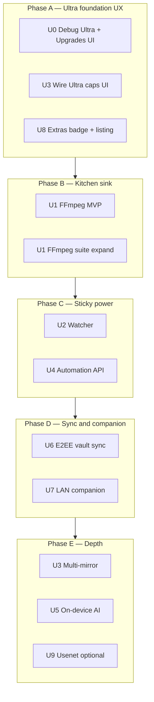

# Aurora Pro Ultra — Full Feature Pack Implementation Plan

| Field | Value |
|-------|-------|
| **Date** | 2026-07-20 |
| **Status** | **Implemented** (2026-07-21) |
| **Parent strategy** | `.opencode/plans/2026-07-19-aurora-pro-ultra-tier-strategy.md` (v2) |
| **Parent implementation plan** | `.opencode/plans/2026-07-19-aurora-pro-ultra-implementation-plan.md` (rev 3) |
| **Security companion** | `docs/SECURITY_AUDIT.md` |
| **FFmpeg spike** | `docs/ffmpeg_spike_pr-21a.md` (complete) |
| **Hard constraints** | One-time purchases only · zero hosting · Play YouTube remains blocked · no DRM |

---

## 1. Current state (honest baseline)

### Already shipped (do not rebuild)

| Area | Status |
|------|--------|
| `EntitlementTier` free / pro / ultra + store v2 + owned SKUs | Done |
| Three product IDs + BillingClient reconcile | Done |
| `ProFeature` catalog incl. Ultra gates | Done (gates only) |
| Dual clamp + engine hard max 64 | Done |
| FreeTaste / free caps / upsell frequency | Done |
| Pro heroes + most Pro fillers (batch, turbo-max, dead-link, LAN, series MVP, vault, WebDAV, audio extract, profiles, clipboard, …) | Done (quality varies) |
| FFmpeg packaging spike doc | Done |

### Ultra product gaps (this plan)

| # | Feature | Code today | Plan goal |
|---|---------|------------|-----------|
| **U0** | Ultra UX / debug / Console | Force Pro only; Ultra SKUs may exist in code | Force Free/Pro/**Ultra**; Settings Upgrades; Console go-live runbook |
| **U1** | FFmpeg Suite | Gate only + spike | Ship MVP then full suite |
| **U2** | Aurora Watcher | Gate only | On-device RSS/page monitor + auto-enqueue |
| **U3** | Server-grade engine | Caps mostly exist | Wire Ultra UI, multi-mirror, host maps |
| **U4** | Automation API | Gate only | Localhost REST + token + Tasker surface |
| **U5** | AI Pack (on-device) | Not started | ML Kit / Nano optional; graceful degrade |
| **U6** | E2EE Vault Sync | WebDAV backup exists (unencrypted JSON) | Encrypt vault+settings over **user** WebDAV/S3 |
| **U7** | Desktop companion | Not started | LAN read-only companion first |
| **U8** | Ultra extras | Gate only | Badge, beta channel flag, support copy |
| **U9** | Usenet/NZB | Parked | Only if Ultra attach > ~10% Pro |

### Non-goals (permanent)

- Aurora-operated cloud relay / storage / AI fallback  
- Built-in VPN / rotating proxies  
- yt-dlp-as-a-service / YouTube-on-Play  
- System-wide VPN adblock  
- Subscriptions / RTDN backend  

---

## 2. Product definition (ship criteria)

**Ultra is done** when a license tester can:

1. Purchase `aurora_ultra_unlock` or Pro→`aurora_ultra_upgrade`.  
2. See **Ultra** badge and tier-correct caps (64 concurrent / 64 chunks / HLS 16).  
3. Run **FFmpeg** compress/trim/audio/GIF on a completed file without crashing.  
4. Create a **Watcher** that auto-enqueues on a new RSS item or page match (battery-friendly).  
5. Call **localhost Automation API** with a token to list/pause/resume queue.  
6. Optionally enable **Vault Sync** to user WebDAV with passphrase (keys never leave device).  
7. Open **Desktop companion (LAN)** and see shared queue (read-only MVP).  
8. Confirm Play restricted hosts still blocked on Ultra.

U5 AI and multi-mirror can ship in a “depth” wave after go-live if calendar slips; U1–U4 + U0/U8 are **go-live blockers**.

---

## 3. Phase plan



| Phase | Calendar (1 eng) | Exit |
|-------|------------------|------|
| **A Foundation UX** | ~1 week | Debug Ultra works; Settings sells Ultra; engine UI shows 64/64 for Ultra |
| **B FFmpeg** | ~2–3 weeks | Compress/trim shippable; About OSS; no ANR on 1080p sample |
| **C Watcher + API** | ~2–3 weeks | One RSS + one page rule work overnight; Tasker can pause/resume |
| **D Vault sync + companion** | ~2–3 weeks | Sync round-trip; companion sees queue on LAN |
| **E Depth** | ~2–4 weeks | Multi-mirror + AI optional; Usenet only if metrics justify |

**Total realistic:** ~8–14 weeks solo for go-live (A–D); E flexible.

---

## 4. Feature design notes

### U0 — Ultra foundation UX (do first)

**Files:** `settings_page.dart`, `pro_upsell_sheet.dart`, `pro_entitlement.dart`, diagnostics export  

**Work:**

1. Replace Debug **Force Pro** switch with dropdown: **Free / Pro / Ultra** → `setDebugTier`.  
2. Settings page title **Upgrades** (or keep Aurora Pro with Ultra section).  
3. Show current tier badge: Free / Pro / Ultra.  
4. Pro users: show **Upgrade to Ultra** CTA (`showUltraUpgrade` / full-price fallback).  
5. Diagnostics: export `{ tier, ownedProductIds, lastReconcileOk, … }`.  
6. Play Console runbook checklist (prices, Family Library, license testers).

**AC:**

- [ ] Debug Ultra unlocks Ultra-only gates without Play.  
- [ ] Free debug → Pro features denied; Ultra → server-grade + ffmpeg gates true.  
- [ ] RestrictedMedia still blocks YouTube on Ultra debug.

---

### U1 — FFmpeg Suite

**Depends on:** spike `docs/ffmpeg_spike_pr-21a.md`  

**MVP (go-live):**

| Op | Input | Output | Notes |
|----|-------|--------|-------|
| Compress | completed video | smaller MP4 (CRF/x264) | progress + cancel |
| Trim | video + start/end | cut MP4 | |
| Audio extract | video | m4a/mp3 | may overlap Media3 Pro path — route Ultra to FFmpeg when advanced codecs needed |
| Remux | TS/container | MP4 | extend existing TS remux or FFmpeg |

**Full suite (post-MVP):** resolution scale, GIF, subtitle mux, batch convert, HEVC↔AVC when binary supports it.

**Architecture:**

```
lib/premium/ffmpeg/
  ffmpeg_service.dart      # execute, cancel, progress stream
  ffmpeg_job.dart          # model
  ffmpeg_ops.dart          # command builders
ui/pages/ffmpeg_studio_page.dart
```

**Hard rules:**

- Gate every entry with `ProFeature.ffmpegSuite`.  
- Kill process on background / job timeout (spike policy).  
- Do not run concurrent with >N downloads if thermal pressure (optional: pause downloads).  
- About OSS notices for FFmpeg + x264.  
- arm64-only; measure APK delta after first integration.

**PR split:**

| PR | Title | AC |
|----|-------|-----|
| **U1-0** | Integrate ffmpeg-kit min-gpl arm64 | App builds; probe `ffmpeg -version` |
| **U1-1** | Compress + progress UI | One sample 1080p finishes; cancel works |
| **U1-2** | Trim + audio extract | Manual QA matrix |
| **U1-3** | GIF + batch + polish | Ultra studio feels complete |

---

### U2 — Aurora Watcher (Sonarr-lite, on-device)

**Stack:** WorkManager / `android_alarm_manager_plus` or existing FGS + periodic timer (prefer WorkManager for Doze).  

**Models:**

```dart
class WatchRule {
  String id;
  WatchKind kind; // rss | page
  String url;
  String? matchRegex; // optional title/link filter
  Duration minInterval; // e.g. 30m–6h
  bool enabled;
  DateTime? lastCheckedAt;
  Set<String> seenIds; // guid/link hash
}
```

**Flow:**

1. Ultra-only Settings → Watcher list.  
2. Background worker fetches RSS or page HTML (Dart HTTP; cookies optional later).  
3. Diff against `seenIds` → `enqueueDirectDownload` or queue dialog skip.  
4. Notification: “Watcher added N items”.  
5. Battery: default interval ≥ 1h; user can tighten only on unmetered Wi-Fi.

**AC:**

- [ ] RSS test feed: new item within one interval enqueues once.  
- [ ] Seen set persists; no re-enqueue storm.  
- [ ] Free/Pro open upsell; Ultra works offline schedule after first enable.

**Risks:** site HTML changes; respect robots lightly; no proxy abuse.

---

### U3 — Server-grade engine

**Already:** `maxConcurrentUltra = 64`, `chunksPerTaskUltra = 64`, HLS ultra 16, engine hard max 64.

**Remaining:**

1. Settings sliders max by tier (Ultra 64).  
2. Per-host connection map UI (optional advanced).  
3. **Multi-mirror:** metalink-style or multi-URL same file (Phase E if needed).  
4. Turbo honesty: Ultra can later get host-adaptive policy; Pro stays tier-max.

**PR U3-1:** UI + docs only.  
**PR U3-2:** multi-mirror downloader path.

---

### U4 — Automation API (localhost)

**Hard security (see SECURITY_AUDIT.md):**

- Bind **`127.0.0.1` only** (never LAN by default).  
- **Not** mounted on `LanFileServer`.  
- Random API token; show once; store hashed.  
- Optional: require Ultra + toggle default **off**.

**MVP endpoints:**

| Method | Path | Action |
|--------|------|--------|
| GET | `/v1/status` | tier, queue counts |
| GET | `/v1/tasks` | list tasks JSON |
| POST | `/v1/tasks` | enqueue URL body |
| POST | `/v1/tasks/:id/pause` | pause |
| POST | `/v1/tasks/:id/resume` | resume |
| POST | `/v1/tasks/:id/cancel` | cancel |

**Auth:** `Authorization: Bearer <token>`  

**Tasker:** document HTTP Request action; optional plugin later.

**AC:** curl from same device works; LAN device cannot connect; wrong token → 401.

---

### U5 — AI Pack (on-device only)

**Scope (graceful degrade):**

| Capability | Tech | Fallback |
|------------|------|----------|
| Scene-release rename | Regex + optional ML Kit entity | Regex-only |
| Library categorize | Rules (ext, path, keywords) | Manual folders |
| Similar/dupe media | Size + name + optional perceptual hash later | Existing dupe finder |
| Saved-page summary | Gemini Nano if present | Hide feature |

**Never** call cloud LLM. If Nano unavailable → feature hidden or “device not supported”.

**PR after go-live** unless spare capacity.

---

### U6 — E2EE Vault Sync (user infrastructure)

**Builds on:** `VaultService` (AES-GCM) + `WebdavBackupService` (HTTPS policy).

**Design:**

1. Derive vault-sync key from user passphrase (Argon2/scrypt) **or** separate X25519 keypair stored in Keystore.  
2. Blob format: version + nonce + AES-GCM(ciphertext) of zip/json of vault files + optional queue snapshot.  
3. Upload to user WebDAV path `/aurora/vault-sync/`.  
4. Restore requires passphrase; wrong passphrase fails closed.  
5. Gate `ProFeature.vaultSync`.

**Do not** put plaintext vault in existing auto WebDAV backup.

**AC:** two devices (or wipe + restore) recover vault with passphrase; server operator cannot read files.

---

### U7 — Desktop companion (LAN)

**MVP (read-only):**

- Flutter desktop or minimal Tauri/Flutter Windows app.  
- Discovers phone via mDNS or user pastes `http://phone-ip:port` + token.  
- Shows queue list + status; **no** remote start of LAN file share of arbitrary paths.  
- Uses **separate** localhost-style API on phone bound to LAN only when Ultra enables “Companion mode” with short-lived token (stricter than Send-to-PC).

**Phase 2:** “Finish download on PC” (hand off URL + cookies carefully — privacy risk).

**AC:** Windows machine on same Wi-Fi sees queue; no Ultra → disabled.

---

### U8 — Ultra license extras

- Ultra badge on About + Settings.  
- Early-access channel copy (Play open testing track).  
- Priority support email/template in About.  
- Family Library: leave enabled (product default).  

Cheap; ship with U0/U3-1.

---

### U9 — Usenet (parked)

Revisit only if Ultra attach rate justifies. Separate design (NNTP client, NZB parse, SSL, credentials in secure storage).

---

## 5. Ordered PR checklist

| ID | Title | Phase | Deps |
|----|-------|-------|------|
| **UP-00** | Debug Free/Pro/**Ultra** + Upgrades UI polish | A | — |
| **UP-01** | Ultra engine sliders + HLS cap UX (U3 wire) | A | UP-00 |
| **UP-02** | Ultra extras badge + Play listing bullets (U8) | A | UP-00 |
| **UP-03** | FFmpeg-kit integrate + version probe (U1-0) | B | spike |
| **UP-04** | FFmpeg compress + trim MVP UI (U1-1/2) | B | UP-03 |
| **UP-05** | FFmpeg suite expand (GIF/batch/OSS) (U1-3) | B | UP-04 |
| **UP-06** | Watcher models + WorkManager + RSS (U2) | C | UP-00 |
| **UP-07** | Watcher page monitor + notifications | C | UP-06 |
| **UP-08** | Automation API localhost + token (U4) | C | UP-00 + SECURITY_AUDIT |
| **UP-09** | Tasker docs + optional plugin stub | C | UP-08 |
| **UP-10** | E2EE vault sync over WebDAV (U6) | D | vault + webdav hardened |
| **UP-11** | Companion mode API + Windows read-only app (U7 MVP) | D | UP-08 patterns |
| **UP-12** | Multi-mirror downloads (U3 depth) | E | UP-01 |
| **UP-13** | On-device AI pack (U5) | E | UP-00 |
| **UP-14** | Console Ultra SKU activation + release notes | A/B | UP-04 |
| **UP-15** | Remove Drive code (PR-29 leftover) | anytime | WebDAV stable |

---

## 6. Testing strategy

| Layer | Coverage |
|-------|----------|
| Unit | FreeTaste unchanged; Ultra minimumTier; WatchRule seen-set; API auth; vault sync crypto vectors |
| Integration | FFmpeg job cancel; Watcher fake RSS server; API curl script |
| Manual device | License tester Ultra purchase; Doze Watcher; thermal FFmpeg; restricted YouTube still blocked |
| Security | See `docs/SECURITY_AUDIT.md` § Regression checklist |

---

## 7. Play Console / listing

1. Activate `aurora_ultra_unlock` ($9.99) + `aurora_ultra_upgrade` ($7.99) when UP-04 demoable.  
2. Regional templates (India Ultra ~₹549–749).  
3. Listing bullets: FFmpeg, Watcher, Automation, Vault Sync — no subscription language.  
4. Data safety form: no new cloud of ours; user WebDAV is user-directed.  
5. Open testing track for Ultra beta (U8).

---

## 8. Risks

| Risk | Sev | Mitigation |
|------|-----|------------|
| FFmpeg size / 16KB page | High | Spike path; measure CI artifact size |
| FFmpeg ANR / thermal | High | Timeout, cancel, FG notification “Converting…” |
| Watcher battery complaints | Med | Long default interval; Wi-Fi only option |
| Automation API abuse | High | Localhost only; token; off by default |
| Companion scope creep | Med | Read-only MVP freeze |
| Over-promising Ultra before FFmpeg | High | Don’t activate public Ultra SKU until UP-04 |

---

## 9. Key decisions

1. **Go-live Ultra = U0 + U1 MVP + U2 + U4 + U3 wire + U8** — not full U5/U7/U9.  
2. **FFmpeg-kit min-gpl arm64** per spike.  
3. **Automation API never shares process/port with Send-to-PC.**  
4. **Vault sync is E2EE over user storage** — not plaintext WebDAV backup.  
5. **Debug tier is Free/Pro/Ultra dropdown** (fixes current Force Pro only).  
6. **U9 parked** until attach metrics.  
7. **Zero hosting** remains absolute.

---

## 10. Open questions (owner)

1. Ship Ultra public SKU after FFmpeg MVP only, or wait for Watcher too?  
2. Desktop companion: Flutter desktop vs thin web UI opened on PC?  
3. Ultra price stick at $9.99?  
4. Include multi-mirror in go-live or Phase E?

**Defaults:** (1) FFmpeg MVP + Watcher + API, (2) Flutter desktop later / web UI first if faster, (3) $9.99, (4) Phase E.

---

## 11. Immediate next actions

1. **UP-00** — Debug Free/Pro/Ultra + Upgrades UX (unblocks all Ultra QA).  
2. **UP-03** — FFmpeg integrate (longest pole).  
3. Keep **SECURITY_AUDIT.md** open checklist green as LAN/API/vault-sync land.  
4. Fix vault lifecycle/auth UX (known product bug) before Ultra marketing of Private Vault Sync.

---

*End of Ultra full feature pack plan.*

---

## Appendix A — Implementation Status (2026-07-21)

### Completed

| PR | Title | Status |
|----|-------|--------|
| UP-00 | Debug Free/Pro/Ultra dropdown + Upgrades UX polish | ✅ |
| UP-01 | Ultra engine sliders + HLS cap UX | ✅ (already wired) |
| UP-02 | Ultra extras badge + OSS notices | ✅ |
| UP-03 | FFmpeg-kit integrate + version probe | ✅ |
| UP-04 | FFmpeg compress + trim MVP UI (Studio page) | ✅ |
| UP-05 | FFmpeg suite expand (GIF/batch/OSS notices) | ✅ |
| UP-06/07 | Watcher models + service + UI page | ✅ |
| UP-08/09 | Automation API localhost + token + UI page | ✅ |
| UP-10 | E2EE vault sync service | ✅ |
| UP-11 | Companion mode | ⏸️ (needs separate Flutter desktop project) |
| UP-12 | Multi-mirror | ⏸️ (Phase E depth) |
| UP-13 | On-device AI pack | ⏸️ (Phase E depth) |
| UP-14 | Console SKU activation | ⏸️ (Play Console manual step) |
| UP-15 | Remove Drive code | ⏸️ (minor cleanup, not blocking) |

### Files created

| File | Purpose |
|------|---------|
| `lib/premium/ffmpeg/ffmpeg_job.dart` | FFmpeg job model |
| `lib/premium/ffmpeg/ffmpeg_ops.dart` | FFmpeg command builders |
| `lib/premium/ffmpeg/ffmpeg_service.dart` | FFmpeg orchestration service |
| `lib/ui/pages/ffmpeg_studio_page.dart` | FFmpeg UI (compress/trim/GIF) |
| `lib/premium/watcher/watcher_models.dart` | WatchRule model |
| `lib/premium/watcher/watcher_store.dart` | Watcher persistence |
| `lib/premium/watcher/watcher_service.dart` | Watcher background service |
| `lib/ui/pages/watcher_page.dart` | Watcher settings UI |
| `lib/premium/automation/automation_api_service.dart` | Localhost REST API |
| `lib/premium/vault_sync_service.dart` | E2EE vault sync |

### Files modified

| File | Change |
|------|--------|
| `pubspec.yaml` | Added `ffmpeg_kit_flutter_min_gpl` |
| `android/.../AndroidManifest.xml` | Added `extractNativeLibs=true` |
| `lib/ui/pages/settings_page.dart` | Major: Upgrades page, debug dropdown, Ultra nav entries, About OSS, FFmpeg/Watcher/Automation pages |
